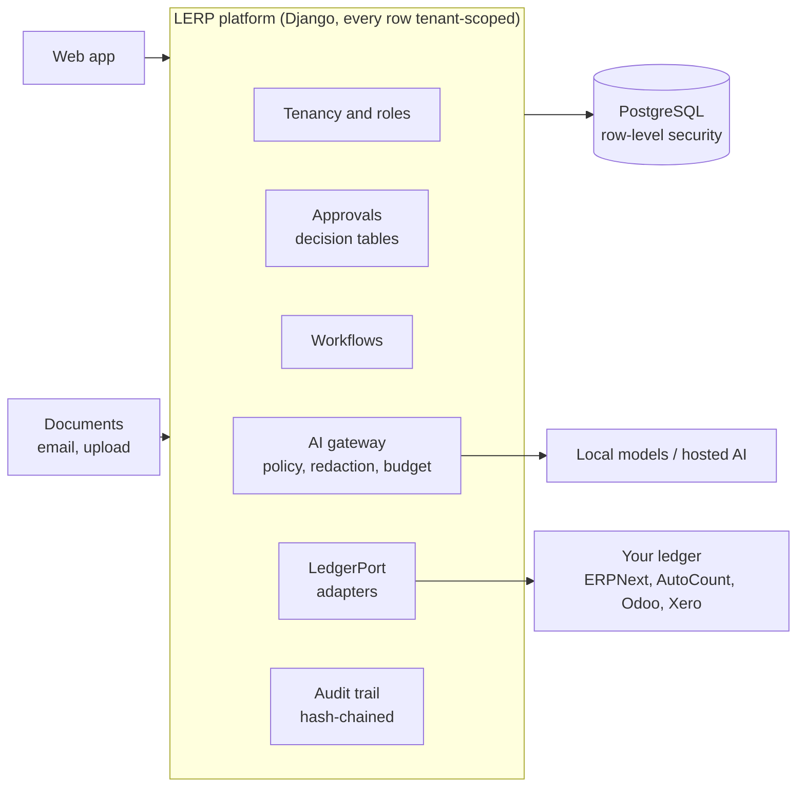

# LERP: Limitless ERP

**Introducing LERP, a Limitless ERP.** LERP is an AI-native operations platform for Malaysian SMEs and mid-market groups. It plugs into the accounting system you already run, so you don't have to replace it.

Most ERP projects force a trade: replace your accounting system, or give up on automation. LERP avoids that trade. It owns the work that happens around the books: capturing documents, matching them, routing approvals, running workflows, applying AI and reporting across companies. It then posts the results into your ledger (AutoCount, SQL Account, Odoo, Xero, or a bundled ERPNext) through a single adapter. The ledger stays the system of record. LERP becomes the place where the work gets done.

## Why "Limitless"

- **No ledger lock-in.** Every ledger sits behind one interface, `LedgerPort`. You can switch ledgers, add one, or keep the one you have without rewriting the platform.
- **No ceiling on tenants or companies.** A group of ten legal entities is one tenant, with shared vendors, intercompany work and consolidation. PostgreSQL row-level security isolates every tenant from every other. Any tenant can move to its own database with a registry change.
- **No per-user licence fees underneath.** Every core component is open source (Django, PostgreSQL, ERPNext, Superset), so running costs don't grow with seat licences.
- **No AI black box.** AI drafts, rules and people approve, and code executes. Nothing an AI produces posts, pays or changes master data without that approval.
- **No data leaves without permission.** Every model call goes through one gateway that enforces each tenant's data policy, redaction and budget. A local-only mode keeps documents in your environment.

"Limitless" does not mean building everything. LERP rents the parts where correctness is hardest and differentiation lowest (the general ledger, tax and statutory reports). It builds only what customers pay for.

## What it does first

The first process, delivered end to end in Phase 2, is accounts payable:

```
invoice arrives → OCR and extraction → validation and duplicate checks → PO/GRN match
   → approval by amount band → idempotent posting to your ledger → payment proposal
```

Straight-through processing applies only when every rule holds. That means an active vendor with unchanged bank details, a match within tolerance, high-confidence fields, an amount under the limit and no anomaly flags. Releasing a payment always takes two people.

## How it fits together



The full assessment covers seven stack options, component comparisons, costs, the security model and the roadmap. It is in [docs/architecture-plan.md](docs/architecture-plan.md), and the decisions taken from it are in [docs/decisions.md](docs/decisions.md).

## Built to run at minimum cost

Cash is small and people are expensive, so the stack is kept as small as it can be while staying credible. Estimates from the plan (§9), in RM per month for infrastructure plus AI:

| Stage | Users | RM / month (est.) |
|---|---|---|
| Proof of concept | 1–3 developers | 25–150 |
| Pilot | 5–15 | 155–870 |
| Production | ~50 | 1,100–3,600 |
| Growing | ~200 | 5,100–16,100 |

How this repository keeps the bill down:

1. **Two containers.** PostgreSQL and the app, under Docker Compose, on one small VM. Measured at idle, the app uses about 110 MB of RAM and PostgreSQL about 45 MB.
2. **PostgreSQL does the heavy lifting.** It holds the data, tenant isolation and the audit trail. Later it also runs queues and workflows (DBOS) and vector search (pgvector, already in the image). There is no Redis, Kafka, Temporal, vector database or Kubernetes until a written trigger fires (plan §10E).
3. **No separate web server.** WhiteNoise serves static files from the app.
4. **AI is off until someone pays for it.** A new tenant has AI off. Hosted calls need a monthly RM budget above zero, use the cheapest small model by default (Claude Haiku 5.5, US$0.10 / 0.50 per million tokens), and are metered per tenant. A hosted model without a configured price is refused.
5. **Cheapest technique first.** Rules and classic ML come before any LLM. An LLM handles only what rules can't.
6. **Open source only.** There are no per-user or per-core licences anywhere in the stack.
7. **Free CI.** One GitHub Actions job, cancelled whenever a newer commit supersedes it.

## Status

This repository starts **Phase 1: Foundation** of the roadmap (plan §12).

- [x] Tenant registry, forced PostgreSQL row-level security, same-tenant composite foreign keys and tenant-scoped ORM managers
- [x] Legal entities and role grants per entity
- [x] Approval engine: versioned decision tables, maker-checker on policy changes, segregation of duties
- [x] Append-only, hash-chained audit trail, protected by a database trigger
- [x] `LedgerPort` interface, an in-memory adapter, and a contract test suite every adapter must pass
- [x] AI gateway: policy routing, redaction, budgets and metering (no model provider is wired in yet)
- [x] Cross-tenant isolation tests, CI and Docker Compose
- [ ] Keycloak: OIDC, MFA and Organizations (deferred to keep the stack at two containers; see ADR-006)
- [ ] Document store on S3-compatible storage with object lock
- [ ] DBOS durable workflows and job queues
- [ ] Backups with a tested restore, OpenTelemetry, and a daily audit anchor hash
- [ ] React + TypeScript web app (until then, the Django admin and the API)

**Next, Phase 2:** AP invoice capture → match → approve → post to the pilot's ledger, plus vendor onboarding with bank verification.

## Quick start

You need Docker with Compose.

```sh
cp .env.example .env      # replace every change-me value
docker compose up -d --build
docker compose exec app python manage.py seed_demo   # needs DJANGO_DEBUG=1 in .env
curl localhost:8000/api/health
```

Then:

- Sign in at http://localhost:8000/admin/ as `dan` with password `lerp-demo`.
- Read the API docs at http://localhost:8000/api/docs.
- Once signed in, send an `X-Tenant: demo` header with any API request to work inside the demo tenant.

The demo tenant has two companies and four users (`alice` AP clerk, `bob` approver, `carol` CFO and admin, `dan` admin). It also has an AP approval policy: below RM 50,000 needs an approver, and RM 50,000 and above needs the CFO.

## Development

```sh
cd backend
python3 -m venv .venv && . .venv/bin/activate
pip install -r requirements-dev.txt

# Tests need PostgreSQL 16+ and a role that is NOT a superuser,
# because superusers bypass row-level security. With .env in place:
docker compose up -d db
docker compose exec db psql -U postgres -c \
  "CREATE ROLE lerp LOGIN PASSWORD 'lerp' CREATEDB NOSUPERUSER NOBYPASSRLS"

pytest
ruff check . && ruff format --check .
```

## Repository layout

```
backend/
  lerp/
    tenancy/     tenant registry, legal entities, roles, row-level security, tenant context
    audit/       hash-chained, append-only audit trail
    approvals/   decision tables, maker-checker, segregation of duties
    ledger/      LedgerPort interface and adapters
    ai/          AI gateway: routing, redaction, budgets, metering
    api.py       REST API (Django Ninja, OpenAPI at /api/docs)
  tests/         isolation, audit, approvals, ledger contract, AI gateway, API
deploy/postgres/ database roles, created on first start
docs/            architecture plan and decision records
compose.yaml     the two-container stack
```

## Ground rules

- No `if tenant == X` in core code. Tenants customise through settings, templates, metadata and versioned rules.
- Every new tenant-owned table extends `TenantScopedModel` and calls `enable_row_level_security` in its migration. A test fails otherwise.
- Money is `Decimal`, never float. Posted entries are reversed, never edited or deleted.
- Every command that moves money carries an idempotency key.
- AI proposes; a rule or a person approves; code executes.

## Before going further

The plan names three questions to settle in writing before building on (plan §2 and §13):

1. **Who is the buyer?** Is this a product for external customers or a tool for one group?
2. **Who owns the code?** If any of it is built on an employer's time, equipment or data, get written agreement first.
3. **Which ledger does the pilot run?** The answer decides which adapter gets built first.

## Licence

No licence has been chosen yet. Until one is added, all rights are reserved. Note that the plan flags GPLv3 obligations if custom ERPNext apps are ever shipped on-premise (plan §5.1).
