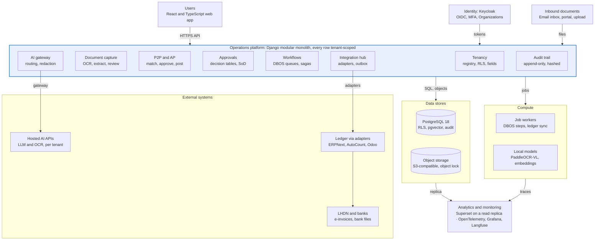
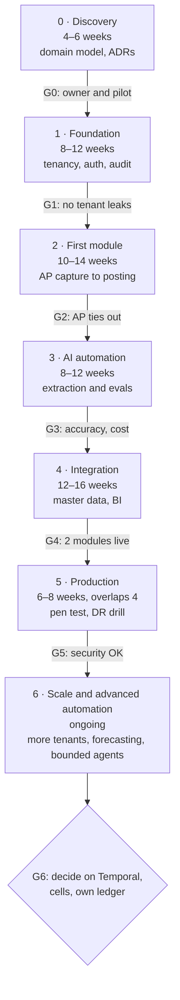

# AI-Powered ERP: Architecture & Tech Stack Assessment

9 October 2026 · Sufi

*Markdown snapshot of the living doc: [AI-Powered ERP: Architecture & Tech Stack Assessment](https://claude.ai/code/artifact/4fba8f4d-ecff-458c-9aaa-123368b02d85). The two diagrams are rendered here as Mermaid.*

## 1. Executive summary

**Build a multi-tenant, AI-native operations platform and plug it into a ledger you don't own.** Don't build a whole ERP, and don't make an existing ERP your product (Opinion). The platform — documents, approvals, workflows, AI, analytics — is where your AP domain knowledge differentiates; the general ledger, tax and statutory reporting are where correctness is hardest and differentiation lowest, so rent them.

How to read this: facts link to sources checked on 9 Oct 2026; 'est.' marks estimates; 'Opinion' marks architectural judgement; A1–A10 are the assumptions in section 2.

### The three decisions you flagged, plus multi-tenancy

| Decision | Recommendation | Main reason | Revisit when |
|---|---|---|---|
| ERP foundation | Python modular monolith for process, documents and AI. The ledger sits behind an adapter: the customer's existing system, or ERPNext as the bundled default. | ERPNext ships full accounting under GPLv3. In Odoo, the MyInvois connector, Malaysian payroll and all Odoo 19 AI are Enterprise-only. | 4+ engineers, and paying tenants who need ledger behaviour you can't configure |
| AI architecture | Hybrid and policy-routed: rules and classic ML first; local models for OCR, embeddings and redaction; hosted models for hard extraction and reasoning; a local-only mode per tenant. | Hosted models cost about RM 20–150 a month at pilot scale; a production GPU costs thousands (est.). | A tenant forbids data egress, or hosted tokens pass ~RM 2,000 a month |
| Workflow execution | Code-defined state machines and versioned decision tables; durable workflows on Postgres (DBOS) now, Temporal later. AI drafts proposals, people approve, code executes. | Money movement stays deterministic and auditable, on one database. | Cross-system sagas multiply, or volume reaches millions of steps a month |
| Multi-tenancy | One shared database, tenant_id on every row, enforced by Postgres row-level security; a registry that can move any tenant to its own database; customisation by configuration, metadata and rules, never per-tenant code. | Nearly free now; retrofitting tenancy later means touching every query. | An enterprise or regulated customer pays for dedicated infrastructure |

Your first deployment is one tenant with many companies. A group of about ten legal entities is one tenant: shared vendors, intercompany and consolidation inside it, hard isolation from every other tenant.

### Recommended starting stack

Django modular monolith · PostgreSQL 18 with row-level security and pgvector · DBOS durable workflows on the same Postgres · Keycloak 26 (OIDC, MFA, Organizations) · React + TypeScript web app · S3-compatible object storage (not MinIO, now archived) · an AI gateway routing to hosted small models and to local PaddleOCR-VL, embeddings and redaction · adapters to the pilot's ledger and to ERPNext v16 · Superset · OpenTelemetry and Langfuse · Docker Compose on Malaysian or Singapore hosting. Section 10 lists what to defer.

### Cost

Cash is small; people are not. Infrastructure plus AI runs est. RM 25–150 a month for a proof of concept, RM 150–900 for a pilot, RM 1,100–3,600 at 50 users, RM 5,100–16,100 at 200 and RM 23,000–69,000 at 1,000 users (section 9). A 2–4 person team costs about RM 25,000–70,000 a month, and writing your own ledger adds est. RM 230,000–650,000 of engineering over 18 months.

### Next 90 days

1. Settle who the buyer is, who owns the code, and which ledger the pilot runs (sections 2 and 13).
2. Build the foundation: tenancy, identity, audit trail and approval engine (Phase 1).
3. Ship one process end to end: AP invoice capture → match → approve → post to the pilot's ledger (Phase 2).

E-invoicing shapes scope: since 1 Sep 2026 MyInvois is mandatory only above RM3 million turnover, so many small pilots are exempt. A small subsidiary is not exempt when a related company is above the line ([The Star](https://thestar.com.my/news/nation/2026/08/30/over-11-million-businesses-to-benefit-from-higher-e-invoicing-threshold-says-lhdn), [3E CPA](https://www.3ecpa.com.my/resources/corporate-compliance-requirement/malaysia-e-invoice/)).

## 2. Key assumptions and unanswered business questions

Ten assumptions carry the recommendation; A1–A3 matter most, and each row says what changes if it's wrong.

| ID | Assumption | If wrong, the recommendation becomes |
|---|---|---|
| A1 | You plus 1–2 developers for the first 18 months; no dedicated DevOps or security staff | With 5+ engineers: build more native modules earlier; adopt Temporal and Kubernetes sooner |
| A2 | The goal is a product for Malaysian SMEs and mid-market firms; the first deployment is one multi-entity group acting as design partner | Internal tool for one group: keep tenant_id in the schema but skip the SaaS plumbing; Odoo Enterprise or ERPNext plus the AI layer becomes faster |
| A3 | The first customer keeps its existing accounting system for at least a year | Greenfield customer: run ERPNext as its ledger from day one |
| A4 | Finance-first scope: AP/P2P, expense claims, document capture, approvals, reconciliations | Sales- or manufacturing-first: lean harder on ERPNext modules; AI shifts toward forecasting |
| A5 | Documents carry personal data (IC numbers, bank details), and some customers will require that documents never leave their environment | No such customers: hosted-first AI, no GPU at any stage |
| A6 | Pilot volume 500–2,000 documents a month; a 50-user customer 3,000–10,000 | At 10x volume: scale out OCR workers; local GPU economics improve |
| A7 | Hosting in Malaysia or Singapore is acceptable; no banks or insurers among early customers | Regulated financial customers: in-country hosting, dedicated tenancy and Bank Negara technology-risk requirements (verify scope) |
| A8 | Interface in English and Malay; documents in English, Malay and Chinese | Other languages: add them to the OCR and model evaluation sets |
| A9 | Infrastructure spend stays under RM 1,000 a month until there is revenue | If funded: managed Postgres and Temporal Cloud earlier |
| A10 | Payroll stays in a specialist payroll system the platform integrates with (EPF, SOCSO, EIS, PCB) | Payroll in scope: budget a statutory calculation engine and a regression test pack |

### Business questions to answer first

1. Product or internal tool? Who buys it, and who pays?
2. Who owns the code? If any part is built on an employer's time, equipment or data, check the IP clause in your employment contract and get written agreement before treating it as your product.
3. Replace or sit on top? Will customers swap their accounting system, or must you integrate with AutoCount, SQL Account, Odoo-based ERPs and Xero?
4. Horizontal or vertical? A horizontal ERP competes with Odoo and ERPNext head-on. A vertical — for example workforce-supply operations with deployments, permits, levies and per-worker-month billing — competes on domain depth you already have.
5. Which pilot, which process first, and which number counts as success (straight-through rate, days to close, cost per invoice)?
6. Which data may leave the customer's environment, and to which countries?

The remaining open questions are in section 13.

## 3. Complete technology stack options

Seven coherent stacks, from build-everything to extend-an-ERP: E is the recommended composition, G the cheapest credible one. A–C differ mainly by language; D by where AI runs; E–G by how much ERP you build versus adopt.

### Option A — Python-first modular monolith (build everything)

One Django codebase owns every module, the general ledger included.

| # | Attribute | Choice |
|---|---|---|
| 1 | Frontend | React + TypeScript single-page app (Vite), TanStack Query/Table, shadcn/ui, AG Grid Community |
| 2 | Backend | Django modular monolith, one app per bounded context; Django Ninja for typed OpenAPI |
| 3 | Primary database | PostgreSQL 18 |
| 4 | Cache and jobs | DBOS queues and schedules on Postgres; Valkey for cache and rate limits when needed |
| 5 | Files | S3-compatible store; per-tenant key prefixes; object lock for evidence |
| 6 | AI | Gateway to hosted small and mid-tier models; local embeddings and classifiers |
| 7 | OCR | PaddleOCR-VL and Docling workers; hosted OCR as fallback |
| 8 | Orchestration | State machines and decision tables in code; DBOS workflows; LangGraph or PydanticAI for bounded agents |
| 9 | Identity and authorisation | Keycloak (OIDC, MFA, Organizations); RBAC/ABAC in the app; Postgres row-level security |
| 10 | API and integration | REST with OpenAPI 3.1, signed webhooks, transactional outbox |
| 11 | Analytics | Read replica + Superset; DuckDB for heavy exports |
| 12 | Hosting | Docker Compose on 1–3 VMs, then managed Postgres, Kubernetes much later |
| 13 | Monitoring | OpenTelemetry to Grafana stack or SigNoz; GlitchTip or Sentry; Langfuse |
| 14 | Testing and CI/CD | pytest, Playwright, Schemathesis, Ruff, pyright, Trivy, GitHub Actions |
| 15 | Cost profile | Lowest licence cost; highest engineering cost, because you write GL, tax and reports |
| 16 | Trade-offs | Full control and the cleanest AI and tenancy design; slowest to a usable ERP; accounting correctness is yours to prove |

Fit check: coherent, one language for app, AI and OCR. The risk is ledger scope creep.

### Option B — TypeScript-first full stack

One language from browser to server; OCR and ML still need Python.

| # | Attribute | Choice |
|---|---|---|
| 1 | Frontend | Next.js or a React SPA, TypeScript end to end |
| 2 | Backend | NestJS modular monolith; Drizzle or Prisma ORM |
| 3 | Primary database | PostgreSQL 18 |
| 4 | Cache and jobs | BullMQ on Valkey, or pg-boss on Postgres |
| 5 | Files | S3-compatible store |
| 6 | AI | TypeScript AI SDKs or LangGraph.js behind a gateway |
| 7 | OCR | Python sidecar service (PaddleOCR and Docling are Python) |
| 8 | Orchestration | Temporal or DBOS TypeScript SDK |
| 9 | Identity and authorisation | Keycloak; policy library for ABAC; row-level security |
| 10 | API and integration | REST/OpenAPI externally, tRPC internally; webhooks |
| 11 | Analytics | Read replica + Superset |
| 12 | Hosting | Containers on VMs; serverless front-end hosting is tempting but complicates data residency |
| 13 | Monitoring | OpenTelemetry, Sentry, Langfuse |
| 14 | Testing and CI/CD | Vitest, Playwright, Pact, GitHub Actions |
| 15 | Cost profile | Similar cash to A, plus a second runtime for OCR and ML |
| 16 | Trade-offs | Shared types front to back; JavaScript has no native decimal, so every money path needs a decimal library; a new language for you |

Fit check: the OCR/ML sidecar makes it polyglot anyway, which removes its main advantage.

### Option C — Enterprise .NET (or Java) architecture

A strongly typed enterprise backend with durable workflows and enterprise identity.

| # | Attribute | Choice |
|---|---|---|
| 1 | Frontend | React + TypeScript (or Blazor) |
| 2 | Backend | ASP.NET Core modular monolith on the current .NET LTS with EF Core (Java alternative: Spring Boot) |
| 3 | Primary database | PostgreSQL 18 (SQL Server adds licence cost) |
| 4 | Cache and jobs | Hangfire or Quartz.NET; Valkey |
| 5 | Files | S3 or Azure Blob Storage |
| 6 | AI | Semantic Kernel or Microsoft's agent framework; Azure OpenAI or a gateway |
| 7 | OCR | Azure Document Intelligence or a Python sidecar |
| 8 | Orchestration | Temporal .NET SDK; Elsa Workflows if a visual designer is required |
| 9 | Identity and authorisation | Keycloak or Entra ID; policy-based authorisation; row-level security |
| 10 | API and integration | REST/OpenAPI externally; gRPC internally |
| 11 | Analytics | Power BI or Superset |
| 12 | Hosting | Azure or VMs, containerised |
| 13 | Monitoring | OpenTelemetry to Azure Monitor or Grafana |
| 14 | Testing and CI/CD | xUnit, Testcontainers, Playwright, GitHub Actions |
| 15 | Cost profile | Moderate; managed Azure services and SQL Server licences add up |
| 16 | Trade-offs | Strong typing, a native decimal type and a deep enterprise hiring pool; more ceremony; AI and OCR tooling lags Python, so a sidecar appears anyway |

Fit check: your .NET portal work makes this learnable, but it doesn't remove the Python sidecar.

### Option D — Fully self-hosted, local-AI stack

The same application as A or E, but every model and service runs on hardware you control.

| # | Attribute | Choice |
|---|---|---|
| 1 | Frontend | React + TypeScript SPA |
| 2 | Backend | Django modular monolith (as A or E) |
| 3 | Primary database | PostgreSQL 18 + pgvector on your own servers |
| 4 | Cache and jobs | DBOS on Postgres; Valkey |
| 5 | Files | SeaweedFS or Garage on local disks; encrypted off-site backups |
| 6 | AI | vLLM on a 24–48 GB GPU server running Qwen3.5/3.6 open weights (Apache 2.0); local embeddings and rerankers |
| 7 | OCR | PaddleOCR-VL-1.6 (Apache 2.0) and Docling (MIT) |
| 8 | Orchestration | DBOS; self-hosted Temporal later; n8n only for internal glue |
| 9 | Identity and authorisation | Self-hosted Keycloak |
| 10 | API and integration | As A |
| 11 | Analytics | Self-hosted Superset |
| 12 | Hosting | Owned servers in an office or a Malaysian colocation site, plus a second site for recovery |
| 13 | Monitoring | Grafana stack; self-hosted Langfuse |
| 14 | Testing and CI/CD | As A, plus model regression tests on every model upgrade |
| 15 | Cost profile | No per-token cost; GPU hardware est. RM 15,000–60,000 plus power, colocation and operations time |
| 16 | Trade-offs | Data never leaves; satisfies no-egress customers; lower model-quality ceiling; you run GPUs, drivers and model upgrades; one GPU is one point of failure |

Fit check: strongest as a per-tenant tier inside E, weak as the whole product.

Sources for option D: [Qwen3.5 guide](https://insiderllm.com/guides/qwen-3-5-local-ai-guide/), [PaddleOCR-VL licence](https://www.spheron.network/blog/best-open-source-ocr-vlm-self-host-gpu-cloud-2026/), [Docling licence](https://www.codesota.com/ocr/mistral).

### Option E — Hybrid AI-native composable architecture (recommended)

A custom platform owns process, documents, approvals and AI; the ledger is a replaceable system of record behind an adapter.

| # | Attribute | Choice |
|---|---|---|
| 1 | Frontend | React + TypeScript SPA for the platform; the ledger's own screens for back-office accounting at first |
| 2 | Backend | Django modular monolith: documents, P2P/AP, approvals, rules, AI, integration, analytics feeds; ledger behind a LedgerPort adapter |
| 3 | Primary database | PostgreSQL 18 for the platform (pooled tenants, row-level security); each bundled ERPNext site keeps its own MariaDB |
| 4 | Cache and jobs | DBOS queues and workflows on Postgres; Valkey for cache, locks and rate limits |
| 5 | Files | S3-compatible (managed in-region, or SeaweedFS self-hosted); per-tenant prefixes; object lock for audit evidence |
| 6 | AI | Gateway with per-tenant policy: hosted small and mid-tier models by default; local models for embeddings, classification and redaction; a local-only tier |
| 7 | OCR | Local PaddleOCR-VL and Docling; hosted OCR or vision model as fallback where policy allows |
| 8 | Orchestration | Seven layers (section 5.3): transactions, state machines, decision tables, jobs, durable workflows, AI steps and read-only agents |
| 9 | Identity and authorisation | Keycloak as the single identity provider for platform and ledger; RBAC/ABAC with segregation-of-duties rules; row-level security |
| 10 | API and integration | Platform REST/OpenAPI, signed webhooks, outbox; adapters for ERPNext, Odoo (JSON-2), Xero and AutoCount (verify its API options); MyInvois via the ledger's app or a platform service |
| 11 | Analytics | Read replica + Superset with row-level security; ledger data synced into an analytics schema |
| 12 | Hosting | Docker Compose on 2–3 VMs in Malaysia or Singapore; managed Postgres at production; Kubernetes past ~50 tenants (est.) |
| 13 | Monitoring | OpenTelemetry to Grafana stack or SigNoz; GlitchTip or Sentry; Langfuse traces tagged with business-object IDs |
| 14 | Testing and CI/CD | pytest, tenant-isolation suite, adapter contract tests, AI evaluation suite, Playwright, GitHub Actions |
| 15 | Cost profile | Low-to-moderate cash; engineering spent only on differentiators |
| 16 | Trade-offs | Two systems to integrate and keep in sync; two interfaces at first; MariaDB beside Postgres when ERPNext is bundled; in return, ERP-agnostic and able to grow its own ledger later |

Fit check: the adapter boundary lets you start on the pilot's existing ledger and add a native ledger later without a rewrite.

### Option F — Extend Odoo (Community + OCA, or Enterprise)

Odoo is the whole platform; your work ships as Odoo modules.

| # | Attribute | Choice |
|---|---|---|
| 1 | Frontend | Odoo web client (OWL) plus custom OWL components |
| 2 | Backend | Custom Odoo modules on the Odoo ORM; external worker for AI and OCR |
| 3 | Primary database | PostgreSQL, one database per tenant |
| 4 | Cache and jobs | Odoo cron; OCA queue_job |
| 5 | Files | Odoo filestore; S3 via OCA storage modules |
| 6 | AI | Enterprise: native Odoo 19 AI. Community: external gateway plus custom modules |
| 7 | OCR | Enterprise invoice digitisation, or an external OCR worker |
| 8 | Orchestration | Automation rules and server actions; OCA tier validation or Enterprise Approvals |
| 9 | Identity and authorisation | Odoo groups and record rules; OAuth/OIDC to Keycloak |
| 10 | API and integration | JSON-2 API from Odoo 19; XML-RPC and JSON-RPC deprecated, removal planned for Odoo 22 (2028) |
| 11 | Analytics | Enterprise dashboards, or Superset on a replica |
| 12 | Hosting | Self-hosted Docker, or Odoo.sh for Enterprise |
| 13 | Monitoring | Generic stack plus Odoo logs |
| 14 | Testing and CI/CD | Odoo test framework and JS tours |
| 15 | Cost profile | Community: free licence, costly upgrades. Enterprise Custom plan: US$20.40–25.50 per user per month in Malaysia |
| 16 | Trade-offs | Largest ecosystem and partner network; your Odoo 18 module work carries over; Community gaps push you to Enterprise; a major version to migrate every year |

Fit check: coherent if you sell as an Odoo partner; awkward if you want your own multi-tenant product.

### Option G — Extend ERPNext / Frappe

ERPNext is the whole platform; your work ships as Frappe apps.

| # | Attribute | Choice |
|---|---|---|
| 1 | Frontend | Frappe Desk plus Frappe UI (Vue) custom pages |
| 2 | Backend | Custom Frappe apps (Python DocTypes); external worker for AI and OCR |
| 3 | Primary database | MariaDB (ERPNext v16 doesn't support PostgreSQL) |
| 4 | Cache and jobs | Built-in RQ workers and scheduler on Redis or Valkey |
| 5 | Files | Frappe File records; S3 via an app |
| 6 | AI | External gateway plus a Frappe app exposing DocTypes as tools |
| 7 | OCR | External OCR worker |
| 8 | Orchestration | Frappe Workflow (states, transitions, roles) plus RQ; Temporal only if sagas demand it |
| 9 | Identity and authorisation | Roles and user permissions; OIDC login via Keycloak |
| 10 | API and integration | Auto-generated REST API per DocType; built-in webhooks; open-source MyInvois app |
| 11 | Analytics | Frappe reports and Insights, or Superset |
| 12 | Hosting | Frappe Cloud (site plans about US$5–200 a month; servers from about US$20) or self-hosted bench; one site per tenant |
| 13 | Monitoring | Frappe Cloud tooling or a generic stack |
| 14 | Testing and CI/CD | Frappe test runner; Playwright |
| 15 | Cost profile | Lowest cash for full ERP breadth; no per-user licence |
| 16 | Trade-offs | Breadth, multi-site tenancy and no-code customisation built in; MariaDB only; framework conventions shape everything; Malaysian payroll needs custom or community work |

Fit check: the best low-cost answer, but it binds your AI to one ERP and its database.

Sources for E–G: [Odoo pricing](https://www.odoo.com/pricing), [Odoo Malaysia pricelist](https://oec.sh/odoo-pricing/malaysia), [Odoo 19 API](https://www.cybrosys.com/blog/overview-of-api-integration-in-odoo-19), [Odoo 19 AI is Enterprise-only](https://apps.odoo.com/apps/modules/19.0/ai_agent_hub), [ERPNext and PostgreSQL](https://discuss.frappe.io/t/is-erpnext-officially-supported-with-postgresql/163329), [ERPNext MyInvois app](https://discuss.frappe.io/t/announcing-the-launch-of-the-malaysia-myinvois-e-invoicing-app-on-frappecloud/148040), [Frappe Cloud pricing](https://docs.frappe.io/customer-guide/pricing/frappe-cloud-pricing).

## 4. Comparison tables

Option E scores highest overall (110 of 140), A is the strongest asset to own but the slowest, and G wins whenever speed and team size dominate.

### Table A — Complete stack comparison (scores 1–10, 10 = best)

| Criterion | A Py build | B TS build | C .NET build | D Self-host AI | E Hybrid | F Odoo CE | G ERPNext |
|---|---|---|---|---|---|---|---|
| Initial development speed | 3 | 3 | 2 | 2 | 7 | 7 | 8 |
| AI integration | 9 | 7 | 6 | 6 | 9 | 5 | 6 |
| Financial transaction reliability | 6 | 5 | 7 | 6 | 8 | 8 | 7 |
| Customisation flexibility | 10 | 10 | 10 | 9 | 9 | 7 | 8 |
| Scalability | 8 | 8 | 9 | 6 | 8 | 7 | 6 |
| Security capabilities | 7 | 6 | 8 | 6 | 8 | 7 | 7 |
| Maintainability for a small team | 6 | 5 | 6 | 4 | 7 | 4 | 6 |
| Open-source availability | 9 | 9 | 8 | 10 | 9 | 5 | 9 |
| Hosting flexibility | 9 | 8 | 8 | 7 | 8 | 7 | 8 |
| Operating cost (10 = cheapest to run) | 8 | 8 | 6 | 5 | 7 | 8 | 9 |
| Learning curve (10 = easiest for you) | 8 | 4 | 6 | 5 | 7 | 6 | 6 |
| Vendor lock-in (10 = least) | 10 | 10 | 7 | 10 | 8 | 5 | 6 |
| Suitability for a small team | 4 | 4 | 3 | 3 | 7 | 6 | 8 |
| Suitability for enterprise use | 7 | 6 | 9 | 5 | 8 | 7 | 6 |
| Unweighted total (of 140) | 104 | 93 | 95 | 84 | 110 | 89 | 100 |

Scoring method:

- Scores are relative within these seven options, for a 1–3 person, Python-strong team building a finance-first, multi-tenant product in Malaysia.
- 10 is always the better end: lowest running cost, easiest learning for you, least lock-in.
- Scores are comparative judgements (Opinion), roughly ±1. The total weights every row equally, which no real decision does.
- F scores Odoo Community plus OCA modules. Enterprise would score higher on speed and AI, lower on cost and lock-in.

The trade-offs that matter:

- E leads because it buys proven accounting while keeping AI, workflow and tenancy design in your hands.
- A closes on E only if control and AI-native design count double (A 133, E 136); it pays for that with the slowest start.
- G overtakes A when speed and small-team fit count double (G 116, A 111); it is the best low-cost answer.
- F loses on maintainability, lock-in and AI because the features Malaysian finance teams need first sit in Enterprise.
- B and C don't remove the Python sidecar for OCR and ML, so they add a language without removing one.

### Table B — Component-by-component comparison

| Component | Pick now | Credible alternatives | Why the pick | Cost note |
|---|---|---|---|---|
| Frontend | React + TypeScript SPA (Vite) | Next.js; Vue/Nuxt; SvelteKit | Largest ecosystem for dense grids and forms; ERP screens sit behind login, so server rendering buys little | Free; AG Grid Enterprise is paid if ever needed |
| Backend framework | Django | FastAPI; NestJS; ASP.NET Core; Spring Boot | ORM, migrations, admin, auth and transactions included; LTS line (5.2 supported to April 2028) | Free |
| Transactional database | PostgreSQL 18 | MariaDB; SQL Server | Row-level security for tenancy, JSONB, native uuidv7, pgvector in one engine | Free; a managed HA pair at 4 GiB is about US$120 a month on DigitalOcean's plans, which change from 30 Nov 2026 |
| Vector search | pgvector 0.8+ | Qdrant; Weaviate | Inherits row-level security and transactions; iterative index scans keep recall under tenant filters | Free; dedicated store only at very large scale |
| Cache and locks | Valkey | Redis 8 (AGPL/SSPL/RSAL); Dragonfly | BSD licence under the Linux Foundation | Free |
| Jobs and durable workflows | DBOS (MIT) on Postgres | Celery + Valkey; Temporal; Hatchet | No extra server; workflow state checkpointed in the same database | Free; Temporal Cloud from US$100 a month |
| Object storage | Managed S3-compatible (AWS Malaysia region, or R2) | SeaweedFS; Garage; Ceph | MinIO's community edition was archived in April 2026 | Cents per GB-month (est.) |
| Identity | Keycloak 26 | Zitadel; Authentik; Entra ID | Organizations feature models tenants inside one realm; MFA, OIDC, SAML at no licence cost | Free; you operate it |
| LLM access | Thin in-house gateway (or LiteLLM) | Provider SDKs direct; OpenRouter | One place for routing, redaction, budgets and logging | Pass-through token cost |
| Local inference | Ollama or llama.cpp (dev); vLLM (GPU production) | SGLang; TGI | Ollama is easiest on one machine; vLLM batches requests for throughput | GPU cost only |
| OCR and layout | PaddleOCR-VL-1.6 + Docling | MinerU 2.5; Mistral OCR API; Azure Document Intelligence | Top open model on OmniDocBench v1.6 at 0.9B parameters, Apache 2.0 | Free locally; APIs US$1–10 per 1,000 pages |
| LLM observability and evals | Langfuse (MIT) | Arize Phoenix; Opik | Self-hostable traces, prompt versions and evaluations | Free self-hosted |
| BI | Superset | Metabase; Power BI; Frappe Insights | Apache 2.0, with row-level filters for tenant dashboards | Free |
| App observability | OpenTelemetry + Grafana stack | SigNoz; Datadog | Vendor-neutral instrumentation | Free self-hosted; SaaS bills by volume |
| CI/CD | GitHub Actions | GitLab CI; Woodpecker | Lives where the code lives | Free tier fits a small team |

Sources: [Django 5.2 support window](https://alternativeto.net/news/2025/12/django-6-0-brings-template-partials-background-tasks-content-security-policy-and-more), [PostgreSQL 18](https://postgresql.org/about/news/postgresql-18-released-3142/), [pgvector iterative scans](https://www.thenile.dev/blog/pgvector-080), [Valkey and Redis licences](https://oneuptime.com/blog/post/2026-03-31-redis-redis-vs-valkey-understanding-the-fork/view), [DBOS](https://github.com/DBOS-project/dbos-transact-py), [Temporal pricing](https://temporal.io/pricing), [MinIO archived](https://pinggy.io/blog/minio_archived_self_hosted_s3_alternatives/), [Keycloak Organizations](https://skycloak.io/blog/is-keycloak-right-for-b2b-saas/), [open OCR rankings](https://blog.roboflow.com/best-open-source-ocr-models/), [Langfuse licence](https://langfuse.com/resources/engineering/clarifications), [DigitalOcean managed Postgres](https://infratally.com/articles/digitalocean-managed-postgres-deep-dive/).

### Table E — Technology risk register

| Risk | Likelihood | Impact | Mitigation | Owner |
|---|---|---|---|---|
| Scope creep into a full custom ERP | High | High | Ledger behind an adapter; native modules only after gate G6 | Product owner (you) |
| AI hallucination in extracted figures | High | High | Schema, arithmetic and master-data validation; confidence thresholds; human review; evaluation gates in CI | AI lead |
| Data leakage across tenants | Medium | Critical | Row-level security, composite keys, tenant-scoped jobs and caches, automated leak tests | Tech lead |
| Data leakage to AI providers | Medium | High | Data classes, redaction, zero-retention terms, local-only tier, egress logging | Security owner / DPO |
| Prompt injection via uploaded documents | High | High | Reader/actor separation; no mutating tools on untrusted text; bank changes only via verified workflow | Security owner |
| Weak accounting controls | Medium | Critical | Idempotency keys, period locks, maker-checker, tested segregation of duties, daily ledger reconciliation | Pilot's finance controller |
| Lock-in to one model provider | Medium | Medium | Gateway abstraction; two providers in every evaluation; open-weight fallback | Tech lead |
| Licence change in infrastructure | Medium | Medium | Prefer OSI licences; licence inventory in the software bill of materials | Tech lead |
| Uncontrolled cloud and AI spend | Medium | Medium | Per-tenant budgets, small-model defaults, batch APIs, alerts | Tech lead |
| Difficult ledger upgrades | High | Medium | Minimal ledger customisation; adapter contract tests; rehearsed upgrades on staging | Integration owner |
| Unnecessary microservices or Kubernetes | Medium | Medium | Modular monolith; written triggers in section 10 | Tech lead |
| Poorly designed multi-tenancy | Medium | High | Tenant registry, quotas, tenant export and restore tested quarterly | Tech lead |
| Inadequate testing of money paths | Medium | High | Property-based tests on posting rules; replay and chaos tests for idempotency | QA owner |
| Unmaintainable customer customisations | High | High | Customisation ladder (section 5.4); no tenant-specific code in core | Product owner |
| Key-person dependency on you | High | High | Decision records, runbooks, a second engineer early | Founder |
| IP ownership dispute with an employer | Unknown | Critical | Written clarity before building on company time, equipment or data | Founder |
| Regulatory change (e-invoicing, PDPA) | High | Medium | Compliance rules as configuration; track LHDN guideline versions | Compliance owner |

## 5. Architecture trade-offs

Four choices carry the architecture: own the process layer but rent the ledger, route AI by data policy, keep money movement deterministic, and design tenancy in from the first migration.

### 5.1 Decision 1 — ERP foundation: modular monolith, Odoo or ERPNext

Own a Python modular monolith for process, documents and AI; keep the ledger behind an adapter; when you must bundle a ledger, bundle ERPNext rather than Odoo Community (Opinion).

| Criterion | Custom modular monolith | Odoo Community + OCA | Odoo Enterprise | ERPNext v16 |
|---|---|---|---|---|
| Accounting out of the box | None; you build GL, AP/AR, tax, close and reports | Invoicing core; reports, assets and reconciliation via OCA modules | Complete | Complete; v16 added configurable financial statements and a consolidated trial balance |
| MyInvois e-invoicing | Build against the LHDN API | Third-party modules | Native connector since Odoo 17 | Open-source app with multi-company and self-billing support |
| Malaysian payroll | Integrate a payroll system | Not native | Enterprise or custom | Custom or community work |
| AI | Your own design | Nothing native | Odoo 19 AI app, agents, invoice OCR, semantic search | Nothing native; build as an app or externally |
| Licence for SaaS hosting | Yours | Core LGPLv3; many OCA modules are AGPL (check each) | Proprietary, per user | GPLv3; serving users over a network isn't distribution |
| Tenancy model | Your design (pool plus silo) | Database per tenant | Database per tenant | Site per tenant, each with its own database |
| Per-tenant no-code customisation | Build a metadata layer | Limited (Studio is Enterprise) | Studio | Custom fields, workflows and scripts per site |
| Upgrades | Your cadence | Yearly majors via OCA OpenUpgrade | Odoo upgrade service, standard apps only | Majors every 1–1.5 years; custom scripts may need fixes |
| Database | PostgreSQL | PostgreSQL | PostgreSQL | MariaDB only |
| Fit with your skills | Strong (Python, Django) | Started (your Odoo 18 module) | Same | New framework, same language |
| Time to a first production finance process | Est. 5–7 months (Phases 0–2, AP on an existing ledger) | Weeks to months | Weeks | Weeks to months |

- **Why not build the ledger now:** a credible GL, AP/AR, tax, close and consolidation is est. 18–30 person-months before it matches what ERPNext ships free, and none of it is what a customer pays extra for.
- **Why not Odoo Community as the core:** the MyInvois connector, payroll localisation, Odoo's AI and the upgrade service are Enterprise-only, so 'free' means maintaining a private Enterprise. Odoo 20 was scheduled to launch on 24–26 Sep 2026, restarting the Community migration clock.
- **Why ERPNext as the bundled default:** complete accounting under GPLv3, one site per tenant, per-site customisation, an automatic REST API and an open-source MyInvois app. Caveats: MariaDB only (PostgreSQL works only in development builds), Malaysian payroll needs work, and community apps vary in quality.
- **Why not all-in on ERPNext (Option G):** your differentiators would be bound to one ERP and its database, and you couldn't serve customers who keep AutoCount, SQL Account, Odoo or Xero.
- **Licence caution:** hosting ERPNext as a service isn't distribution under GPLv3, but shipping your custom apps to an on-premise customer may make them GPL. Get legal advice before any on-premise offer.

| Concern | System of record | Platform's role |
|---|---|---|
| Posted journals, balances, tax ledgers, statutory reports, fixed-asset register, period locks | Ledger | Reads them; requests postings through idempotent commands |
| Documents, extractions, evidence, AI suggestions, reviewer decisions | Platform | Owns them |
| Approvals, workflow state, segregation-of-duties checks | Platform | Owns them |
| Vendor onboarding and bank-detail verification | Platform | Runs the workflow; pushes approved records to the ledger |
| Chart of accounts, tax codes, item and party codes | Ledger | Keeps a synced read-only copy |
| Cross-system analytics | Platform | Combines both sources |

The LedgerPort is one interface with one adapter per ledger: upsert party · upsert item · create draft purchase or sales invoice · post journal with an external reference (idempotent) · read open items, balances and payments · read period status · read e-invoice status. Build the adapter for whatever the pilot runs first; then ERPNext (REST), Odoo (JSON-2; on Odoo Online the external API needs the Custom plan) and Xero; AutoCount through its integration options (verify).

Revisit when you have four or more engineers and paying tenants need ledger behaviour you can't configure, such as per-worker-month revenue recognition. Then write a native LedgerPort and migrate tenants one at a time (opening balances and open items), never as a big-bang rewrite.

Sources: [ERPNext licence](https://github.com/frappe/erpnext/blob/develop/license.txt), [Odoo Community licence](https://erpfocus.com/open-source-manufacturing-software-comparison), [ERPNext v16 features](https://discuss.frappe.io/t/erpnext-hrms-frappe-framework-v16-release-dates/156349), [Odoo Malaysia localisation](https://ecosire.com/blog/odoo-malaysia-localization-guide-2026), [Odoo upgrade service](https://cloudpepper.io/docs/how-to-upgrade-odoo-to-a-higher-version/), [Odoo external API plans](https://www.odoo.com/documentation/saas-19.4/developer/reference/external_rpc_api.html), [Odoo 20 launch](https://www.nalios.com/en/blog/our-blog-1/odoo-experience-2026-the-nalios-guide-to-enjoy-it-199), [ERPNext and PostgreSQL](https://discuss.frappe.io/t/is-erpnext-officially-supported-with-postgresql/163329), [ERPNext v16 upgrade notes](https://discuss.frappe.io/t/erp-v16-clarifications/158512).

### 5.2 Decision 2 — AI: hosted, local or hybrid

Route each AI task by data class and difficulty: rules and classic ML first, local models where data must stay or the task is simple, hosted models where quality matters and policy allows (Opinion).

| | Hosted only | Local only | Hybrid (recommended) |
|---|---|---|---|
| Quality ceiling | Highest (frontier models) | Mid-tier open weights; Qwen3.5-35B-A3B beat GPT-5-mini on 58 of 74 benchmarks, per DeepLearning.AI | Highest where policy allows |
| Cash cost at 50 users (est.) | RM 60–1,100 a month | RM 1,500–3,000 a month for a rented GPU, or RM 15,000–25,000 of hardware | RM 150–700 a month, plus a GPU only for local-only tenants |
| Data control | Depends on contract and region | Complete | Per tenant and per data class |
| Operations burden | Low | High: GPUs, drivers, model updates, capacity | Moderate |
| Resilience | Provider outages; keep a second provider | One GPU is one point of failure | Fails over in both directions |

What an 8 GB consumer GPU can and can't do (est., single user):

| Workload | Fits 8 GB VRAM? | Practical use |
|---|---|---|
| PaddleOCR-VL-1.6 (0.9B parameters) | Yes, easily | Local OCR and layout at pilot volumes |
| Embedding and reranking models (under 1B) | Yes; CPU also works | Keeps vector indexes fully local |
| Qwen3.5-4B at 4-bit (~3.4 GB file) | Yes, with room for a 16–32k context | Classification, routing, simple extraction |
| Qwen3.5-9B at 4-bit (est. 5.5–6.5 GB) | Tight; shorter context | Better local extraction for one user |
| Qwen3.5-35B-A3B at 4-bit (~22 GB) | No; runs only with experts offloaded to system RAM, slowly | Overnight batches and experiments |
| Serving 50 users at once | No | Needs a 24–48 GB server GPU or hosted APIs |

A desktop GPU reached over a VPN is fine for demos with synthetic or redacted documents. Production documents belong on managed hardware with backups and a data-processing agreement. An Apple-silicon machine with plenty of unified memory can hold larger quantised models than an 8 GB card, at lower throughput (est.).

| Task | Default engine | Escalate to | Data rule |
|---|---|---|---|
| Document type classification | Classic ML or a small local model | Small hosted model | Any |
| OCR and layout | Local PaddleOCR-VL or Docling | Hosted OCR for low-confidence pages | Only if the tenant allows egress |
| Field extraction | Small hosted model on OCR text (local 4–9B model in local-only mode) | Mid-tier vision model on page images | Redact identifiers the task doesn't need |
| PII detection and redaction | Local rules plus a small NER model | — | Always local |
| Embeddings and reranking | Local models | — | Always local |
| GL, tax and cost-centre suggestions | Classic ML on posting history, plus rules | Small model for the explanation | Any |
| Duplicates and anomalies | Deterministic keys plus statistical models | Small model to explain the flag | Any |
| Forecasting | Statistical and ML time-series models | — | No LLM needed |
| Assistant Q&A over documents | Small hosted model with permission-filtered retrieval | Mid-tier model | Per-tenant policy |
| Variance commentary, report drafts | Mid-tier hosted model fed computed numbers | — | Aggregates only |
| Investigations (agents) | Mid-tier model with read-only tools | Frontier model | Proposals only |

Data protection:

- Sending personal data to a model hosted outside Malaysia is a cross-border transfer. Since 1 Apr 2025 the PDPA allows transfers to places with substantially similar law or adequate protection, guided by the Commissioner's 29 Apr 2025 guideline; breach notification and DPO duties apply from 1 Jun 2025.
- Amazon Bedrock has run in the AWS Malaysia region (ap-southeast-5) since Sep 2025. Check which models are offered there before promising in-country inference.
- Require from any provider: no training on your data, zero or short retention, a data-processing agreement, and a named region where available.

At your scale, local inference is a privacy decision, not a cost decision. A rented GPU at est. RM 2,000 a month buys about 2.4 billion tokens a month at US$0.20 per million — far more than 50–200 ERP users generate.

Revisit when a tenant forbids egress (add a 24–48 GB GPU tier), when hosted spend stays above ~RM 2,000 a month (price a GPU), or when local open weights pass your evaluation thresholds (shift traffic local).

Sources: [Qwen3.5 local guide](https://insiderllm.com/guides/qwen-3-5-local-ai-guide/), [Qwen3.5 benchmarks](https://charonhub.deeplearning.ai/alibabas-latest-flagship-models-are-open-weights-moe-performers-in-sizes-from-less-than-1b-parameters/), [OCR rankings](https://blog.roboflow.com/best-open-source-ocr-models/), [PDPA amendment timeline](https://insightplus.bakermckenzie.com/bm/data-technology/malaysia-personal-data-protection-amendment-act-2024-to-come-into-force), [cross-border guideline](https://www.mayerbrown.com/en/insights/publications/2025/07/from-legislative-reform-to-practical-guidance-key-amendments-to-malaysias-pdpa-and-the-launch-of-cross-border-transfer-guidelines), [Bedrock Malaysia launch](https://aws.amazon.com/de/about-aws/whats-new/2025/09/amazon-bedrock-thailand-malaysia-taipei-regions/), [Bedrock regions](https://docs.aws.amazon.com/bedrock/latest/userguide/endpoints-region-availability.html).

### 5.3 Decision 3 — Workflow execution: rules and durable workflows, AI assisting

Encode every business process as code and data; AI fills fields, suggests and explains, and its output stays a proposal until a rule or a person accepts it (Opinion).

| Layer | Handles | Technology now | Example | AI's role |
|---|---|---|---|---|
| 1. Transaction | One atomic change to money or master data | Django service plus one Postgres transaction | Post an approved AP invoice | None; it receives validated input only |
| 2. State machine | Document lifecycle, guards, segregation of duties | Explicit transitions in code, each audited | Draft → Submitted → Approved → Posted → Paid | Can't move a document between states |
| 3. Decision table | Approval matrices, tolerances, routing, straight-through eligibility | Versioned rules stored as data; maker-checker on every change | Above RM 50,000 needs the CFO; price variance over 2% goes to the buyer | May propose a rule change; can't activate one |
| 4. Background job | OCR, sync, notifications, report builds | DBOS queues: idempotent, retried | Re-run OCR on a low-confidence page | Runs inside jobs |
| 5. Durable workflow | Long-running, multi-step work with waits, timers and compensation | DBOS workflows on Postgres now; Temporal later | Vendor onboarding with bank verification; payment run; MyInvois submission with retries; month-end close checklist | Individual steps may call AI |
| 6. AI step | Extract, classify, suggest matches, draft, explain | Gateway call inside a workflow step | Suggest a GL code with reason and confidence | Produces a proposal with confidence |
| 7. Agent | Open-ended investigation across tools | LangGraph or PydanticAI with read-only tools | Why doesn't this supplier statement tie? | Proposes; a person approves any change |

A straight-through rule for AP looks like this — every condition must hold, otherwise the invoice goes to the review queue:

1. Vendor active, with bank details unchanged for at least 90 days.
2. PO and goods receipt match within the tenant's tolerances.
3. Totals, tax, dates and invoice number validated and above the confidence threshold.
4. Amount at or below the tenant's straight-through limit.
5. No duplicate or anomaly flag.

Payment release always needs two people, even for an invoice that posted straight through.

Engine choices:

- **DBOS now:** an MIT-licensed library that checkpoints workflows in Postgres and adds durable queues and schedules, so day one has no extra server.
- **Temporal later:** when you run roughly 20+ workflow types with cross-system compensation, need workers in several languages, or reach millions of steps a month. Temporal Cloud Essentials starts at US$100 a month with 1 million actions, then about US$50 per extra million.
- **Not Camunda now:** Camunda 8 Self-Managed has needed a production licence since 8.6, and Camunda 7 Community Edition reached end of life in October 2025. BPMN modelling earns its cost when business analysts own process design.
- **Not n8n inside the product:** its Sustainable Use License allows internal use and backend use where end users never touch n8n; products whose value comes substantially from n8n workflows need a commercial licence. Use it, or Activepieces, for internal glue only.

Sources: [DBOS](https://github.com/DBOS-project/dbos-transact-py), [Temporal pricing](https://temporal.io/pricing), [Camunda 8.6 licence](https://docs.camunda.io/docs/reference/announcements-release-notes/860/860-announcements), [Camunda 7 CE end of life](https://forum.camunda.io/t/camunda-7-community-edition-end-of-life/48995), [n8n licence FAQ](https://docs.n8n.io/n8n-community-license/community-license/license-faq).

### 5.4 Multi-tenancy, tenant isolation and customer-specific customisation

Make tenancy a property of every row, query, job, file, cache key and AI call from the first migration, then run all tenants in one database until a customer pays for their own (Opinion).

The hierarchy is platform → tenant → legal entity → branch or cost centre. A tenant is a customer contract and the isolation boundary; a legal entity has its own books, tax IDs and currency. Users have one identity, a membership per tenant and roles per entity; intercompany and consolidation happen inside a tenant, never across tenants.

| Model | Isolation | Cost per tenant | Migrations at 1,000 tenants | Per-tenant restore | Use for |
|---|---|---|---|---|---|
| Pool: shared tables, tenant_id, row-level security | Logical, enforced by the database | Lowest | One run | Needs a tenant export tool | Default for SMEs |
| Bridge: schema per tenant | Separate namespaces | Low | 1,000 runs; catalogue bloat | Medium | Avoid (Opinion) |
| Silo: database or full stack per tenant | Physical | Highest | One run per tenant | Easy (snapshot) | Enterprise, regulated or local-only-AI tenants |

Route every request through a tenant registry (tenant → database, region, AI policy, plan), so moving a tenant from pool to silo is a data copy plus a registry change. Use uuidv7 keys, native in PostgreSQL 18, so ids never collide when tenants move between databases.

Enforcement, layer by layer:

1. **Identity:** Keycloak Organizations puts the tenant in the token; the app takes the tenant from the token, never from the request body.
2. **Database:** row-level security on every tenant table, keyed on a setting made with SET LOCAL inside each transaction so it survives PgBouncer transaction pooling. The app role is neither table owner nor BYPASSRLS, and tables use FORCE ROW LEVEL SECURITY.
3. **Keys:** composite foreign keys that include tenant_id, so no row can point at another tenant's vendor.
4. **ORM:** default managers scoped to the current tenant, as a second line behind the database.
5. **Files:** object keys prefixed by tenant, short-lived presigned URLs, and per-tenant data keys for restricted fields, so deleting a key crypto-shreds a departed tenant's data.
6. **Vectors:** embeddings in the same Postgres under the same policies; pgvector 0.8 iterative scans keep recall under tenant filters, and large tenants get their own partition.
7. **Jobs:** tenant_id in every job payload; workers set the database context before touching data; per-tenant concurrency limits stop noisy neighbours.
8. **Caches:** keys namespaced by tenant; no semantic cache shared across tenants.
9. **AI:** per-tenant model policy, budget and prompt overrides; no tenant's data trains or tunes anything another tenant uses.
10. **Tests:** an automated cross-tenant suite in CI that attacks the API, ORM, raw SQL, files, vector search, exports and jobs.

| Level | What a tenant can change | How | Who |
|---|---|---|---|
| L0 Settings | Numbering, fiscal year, currencies, tax codes | Configuration screens | Tenant admin |
| L1 Templates | Chart of accounts, approval-matrix starters, document types | Copied at onboarding, versioned | You |
| L2 Metadata | Custom fields, forms, list views, report definitions | JSONB plus a field registry with types and validation | Tenant admin |
| L3 Rules and workflows | Decision tables, approval chains, SLAs, notifications | Versioned; running instances keep the version they started on | Tenant admin, with maker-checker |
| L4 Integration | Webhooks, inbound API, connector settings | Signed, rate-limited, per-tenant credentials | Tenant IT |
| L5 Extension code | Only for silo tenants, through published extension points | Separate package, reviewed, deployed per silo | You, for a fee |

Never put `if tenant == X` in core code, hand-edit a tenant's schema, or fork the product for one customer.

Lifecycle: expand-and-contract migrations, per-tenant feature flags and canary tenants for each release. A tenant export and import tool, tested quarterly, gives per-tenant restore and answers PDPA data-portability requests. When ERPNext is bundled, each tenant gets its own site — a silo by default — and the platform holds one set of adapter credentials per tenant.

Sources: [PostgreSQL 18 uuidv7](https://postgresql.org/about/news/postgresql-18-released-3142/), [Keycloak Organizations](https://skycloak.io/blog/is-keycloak-right-for-b2b-saas/), [pgvector iterative scans](https://www.thenile.dev/blog/pgvector-080), [PDPA data portability](https://insightplus.bakermckenzie.com/bm/data-technology/malaysia-personal-data-protection-amendment-act-2024-to-come-into-force).

### 5.5 Transaction integrity for financial workflows

Duplicate postings, unbalanced journals and half-finished transactions are stopped by the database and one posting service, not by careful users or careful models.

| Failure | Prevention |
|---|---|
| Duplicate posting | Unique key on (tenant, source document, posting purpose); an idempotency key on every command; the adapter sends the same external reference, so the ledger rejects repeats |
| Duplicate supplier invoice | Unique key on (tenant, vendor, normalised invoice number); a fuzzy duplicate score raises a warning beyond that |
| Unbalanced journal | Deferred constraint trigger: debits equal credits per journal; amounts stored as numeric, never float |
| Partially completed transaction | One database transaction per posting; cross-system steps run as a durable workflow with retries and compensation; events leave through an outbox |
| Platform and ledger drifting apart | Daily reconciliation of postings and balances; any drift opens an exception |
| Unauthorised change | Posted entries are immutable (reverse, never edit or delete); period locks; maker-checker above limits; segregation-of-duties rules under test |
| Lost or altered history | Append-only audit table, hash-chained per tenant; a daily anchor hash written to object storage with object lock; the app role can't update or delete audit rows |
| Concurrent edits | Version column for optimistic locking; row locks for document sequences |
| Duplicate events | At-least-once delivery plus an inbox table of processed event IDs |

AI output enters this path only as a proposal that passes the same validation as a human entry.

### 5.6 Other architectural trade-offs

| Choice | Now | Revisit when |
|---|---|---|
| Modular monolith or microservices | Modular monolith with enforced module boundaries; separate worker images for OCR and AI | A module needs independent scaling or its own team |
| Synchronous APIs or asynchronous events | Synchronous for user actions; outbox events for integration and side effects | Fan-out or event volume needs a broker (NATS, Kafka) |
| Relational or distributed storage | PostgreSQL for everything transactional | One primary can't scale further; then shard by tenant into cells |
| One database or specialised databases | PostgreSQL with pgvector and full-text search; object storage for files | Analytics events outgrow a read replica; then add ClickHouse |
| Hosted or self-hosted AI | Hybrid, per section 5.2 | A tenant's policy or sustained volume changes the maths |
| Shared application or multi-tenant SaaS | Multi-tenant data model now, one pilot tenant running | The second paying tenant signs |
| Build or integrate | Integrate ledger and payroll; build the process layer | Gate G6 in section 12 |

## 6. Department automation matrix

Finance and procurement carry the highest automation value and the strictest approvals, so they come first; most other departments reuse the same document, approval and AI services. Table C is split in two to stay readable.

### Table C1 — Modules, workflows and automation technology

| Department | Core module lives in | Automatable workflows | Automation technology |
|---|---|---|---|
| A. Finance and accounting | Ledger (GL, AR/AP sub-ledgers, assets); platform for capture, reconciliation and close | Invoice and receipt capture, matching, accrual drafts, bank and supplier-statement reconciliation, close checklist, management packs | Decision tables, durable workflows, scheduled jobs |
| B. Procurement (P2P) | Platform for requisitions, approvals and vendor onboarding; ledger for PO and goods receipt | Requisition to PO, three-way match, vendor onboarding with bank verification, quotation comparison | State machines, decision tables, durable workflows |
| C. Sales, CRM, order-to-cash | Ledger orders and invoices; Frappe CRM or the customer's CRM | Quote → order → invoice → MyInvois → collections | Workflows, scheduled dunning |
| D. Inventory and warehouse | Ledger stock module | Reorder points, transfers, cycle counts, expiry alerts | Rules, scheduled jobs, barcode apps |
| E. HR and workforce | Frappe HR or the existing HR system; payroll stays external | Onboarding checklists, leave, rosters, expense claims | Workflows, checklists |
| F. Manufacturing | Ledger manufacturing (BOM, MRP, work orders) | Work orders, MRP runs, quality checks, maintenance schedules | MRP engine, rules |
| G. Projects and services | Ledger projects plus a helpdesk | Timesheets, billing, ticket routing, SLA timers | Workflows, SLA timers |
| H. Marketing and e-commerce | External tools, integrated | Segment sync, campaign follow-ups, catalogue sync | Integrations, scheduled jobs |
| I. Legal, compliance, documents | Platform document repository | Contract register, renewal alerts, retention, audit evidence | Workflows, retention jobs |
| J. IT, admin, BI | Platform admin, helpdesk, BI | Access requests, asset register, data-quality alerts | Workflows, monitoring |
| K. Cross-department AI | Platform | Approvals, notifications, search, assistant | AI gateway, retrieval, tool registry |

### Table C2 — AI, approvals, dependencies and complexity

| Department | Appropriate AI techniques | Human approval required for | Depends on | Complexity |
|---|---|---|---|---|
| A. Finance | OCR and LLM extraction, classic ML for coding suggestions, anomaly detection, forecasting, LLM variance commentary | Postings outside straight-through rules, journals, accruals, every payment | Master data, procurement, banks | High |
| B. Procurement | Quote comparison, price-variance anomalies, supplier scoring, email drafts | POs above limits, new vendors, bank-detail changes | Finance, inventory | Medium-high |
| C. Sales and CRM | Lead scoring, churn risk, collection prioritisation, proposal drafts | Discounts beyond policy, credit limits, write-offs | Finance, inventory | Medium |
| D. Inventory | Demand forecasting, discrepancy detection, delivery-order extraction | Write-offs and count adjustments | Procurement, sales | Medium-high |
| E. HR | Policy Q&A over approved documents, roster conflict detection, staffing forecasts | Every employment decision; payroll | Payroll provider, finance | Medium, high sensitivity |
| F. Manufacturing | Forecasting, waste patterns, maintenance prediction, cost-variance explanation | Production plans, scrap | Inventory, costing | High |
| G. Projects | Status summaries, schedule and budget risk detection, ticket classification | Change orders, billing | Finance, HR | Medium |
| H. Marketing | Content drafts, segmentation, attribution analysis | Every published message | CRM | Low-medium |
| I. Legal and compliance | Clause extraction, renewal detection, policy summaries | Every legal or compliance conclusion | All departments | Medium |
| J. IT and BI | Ticket triage, natural-language reporting, data-quality alerts | Access grants | All departments | Medium |
| K. Cross-department | Retrieval, tool calling, evaluation, monitoring | Any action that changes data | All departments | High |

### Capabilities missing from the brief

- **Treasury and bank connectivity:** statement import, payment files, cash positioning.
- **Tax and e-invoicing hub:** MyInvois including self-billed and consolidated e-invoices, SST, withholding tax.
- **Supplier and customer portals:** invoice submission, statements, remittance advice.
- **Master-data governance:** stewardship and duplicate detection for vendors, customers and items.
- **Governance, risk and internal audit:** control testing, segregation-of-duties monitoring, evidence collection.
- **Records retention and e-discovery:** retention schedules and legal holds.
- **A vertical module for workforce-supply companies:** worker deployment, permits and levies, per-worker-month billing and margin. This is where your domain knowledge is hardest to copy.

## 7. AI architecture and security controls

One shared AI layer serves every department: a gateway that enforces tenant policy, a document pipeline, permission-aware retrieval, a tool registry and an evaluation harness. AI never holds more authority than the user it acts for.

### 7.1 The shared AI layer

| Component | Purpose | Build or adopt | Phase |
|---|---|---|---|
| AI gateway | Single exit for every model call: provider abstraction, routing, retries, timeouts | Build a thin module, or adopt LiteLLM | 1 |
| Policy engine | Data class × tenant policy → allowed models, regions and redaction rules | Build as a decision table | 1 |
| Prompt and model registry | Versioned prompts, JSON schemas and model pins; changes ship through review and an evaluation gate | Build: files in git plus a database index | 3 |
| Document pipeline | Ingest → malware scan → classify → OCR and layout → extract → validate → score → review | Build on PaddleOCR-VL, Docling and ClamAV | 2–3 |
| Retrieval | Full-text plus vector search, permission filters in SQL, a reranker | Build on Postgres full-text search and pgvector | 3–4 |
| Tool registry | Typed tools mapped to platform commands; each declares its permission and its effect: read, propose or execute | Build | 4 |
| Review queue | One inbox for low-confidence fields, flags and proposals; captures every correction | Build | 2 |
| Evaluation harness | Golden sets per document type and tenant; regression tests in CI; online accuracy metrics | Adopt Langfuse datasets plus pytest | 3 |
| Cost metering | Tokens and cost per tenant, feature and model; budgets and alerts | Build on gateway logs | 3 |
| Guardrails | Untrusted-input isolation, output schema validation, tool allowlists, injection tests | Build | 3 |
| Logging and retention | Prompts and outputs encrypted and kept per tenant policy; aggregates kept longer | Build | 3 |

### 7.2 Specification per AI capability

| Capability | Input | Processing | Output | Validation |
|---|---|---|---|---|
| Invoice and receipt extraction | PDF or image; vendor master; open POs | Local OCR and layout → small model with a JSON schema; vision model on low confidence | Header, lines, tax and totals, each with confidence | Arithmetic, SST rates, dates, vendor and bank match master data, duplicate key |
| PO–GRN–invoice matching | Extracted invoice, PO, goods receipt | Deterministic matching within tolerances; LLM only explains mismatches | Match result with variance reasons | Tenant tolerance rules |
| Duplicate and anomaly flags | AP history | Exact keys, fuzzy similarity, isolation forest | Risk score with reasons | Thresholds tuned on labelled history |
| GL, cost-centre and tax-code suggestion | Line text, vendor, history | Classifier trained on posting history; LLM fallback with a reason | Top three codes with confidence | Allowed-code lists per entity |
| Supplier statement reconciliation | Statement PDF or CSV, open items | Extraction plus deterministic matching; LLM drafts the query email | Matched and unmatched lists, draft email | Matched items sum to the statement balance |
| Bank reconciliation | Bank statement file, ledger items | Rules and fuzzy matching; ML on past matches | Suggested matches | Amount and date tolerances; one-to-many sums |
| Cash-flow forecast | Open AR and AP, history | Statistical and ML time-series models | 13-week forecast with intervals | Back-test error tracked monthly |
| Variance commentary | Management accounts, budget | Deterministic variance calculation → LLM narrative from those numbers only | Draft commentary | Every number traced to a source cell |
| Policy and HR Q&A | Approved documents | Permission-filtered retrieval → LLM answer with citations | Answer plus citations | No citation, no answer |
| Natural-language reporting | Question, governed semantic views | LLM writes a query against read-only views under row-level security | Table or chart, with the query shown | Read-only role, row limits |
| Contract clause extraction | Contracts | OCR → schema extraction | Parties, dates, renewal terms, key clauses | Reviewer confirms |
| Ticket triage | Ticket text | Classifier or small model | Category, priority, route | Confidence threshold |

| Capability | Human approval | Failure handling | Audit record | Running cost (est.) |
|---|---|---|---|---|
| Invoice and receipt extraction | Review below thresholds; posts only under straight-through rules | Manual entry, re-OCR, or escalate to a stronger model | File hash, model and prompt version, raw output, corrections | RM 0.002–0.05 per document hosted; near zero locally |
| PO–GRN–invoice matching | Exceptions only | Routed to the buyer | Match decision and rule version | Near zero |
| Duplicate and anomaly flags | Every flag reviewed | Payment blocked until reviewed | Score, features, reviewer decision | Near zero (local ML) |
| GL, cost-centre and tax-code suggestion | The poster accepts or changes it | Field left blank | Suggestion versus final code, kept as training signal | Near zero |
| Supplier statement reconciliation | A person sends any email | Manual reconciliation | Matches and overrides | Under RM 0.10 per statement |
| Bank reconciliation | Accountant confirms matches | Items left unmatched | Match rationale | Near zero |
| Cash-flow forecast | Finance reviews before use | Last good forecast shown | Model version and inputs | Near zero |
| Variance commentary | Controller edits and approves | Numbers-only report | Prompt, numbers used, edits | Under RM 1 per pack |
| Policy and HR Q&A | None; answers can't act | 'Not found in approved documents' | Question, sources, answer | RM 0.003–0.07 per question |
| Natural-language reporting | None; read-only | Show the query, ask to rephrase | Query text and row count | RM 0.003–0.07 per question |
| Contract clause extraction | Legal reviewer confirms | Manual review | Extraction and reviewer changes | Under RM 0.10 per contract |
| Ticket triage | Agent can override | Default queue | Prediction versus final route | Near zero |

### 7.3 Permission-aware AI

The assistant can only see and do what the signed-in employee can, because every retrieval and tool call runs with that employee's identity and passes through the same database policies.

- **On-behalf-of identity:** every AI request carries the user's token; no superuser service account reads tenant data.
- **Retrieval:** candidate passages are filtered in SQL by tenant (row-level security) and by document permissions (entity, department, confidentiality) before ranking. At answer time each cited source is re-checked against the user's current permissions.
- **Context building:** salaries, IC numbers and bank accounts are masked unless the user's role allows them.
- **Tools:** each tool declares its permission and effect. Read tools run directly; propose tools create a draft for review; execute tools need explicit confirmation and, for sensitive actions, step-up MFA plus a second approver.
- **Caching:** only within one tenant and one permission scope.
- **Logging:** every AI action records user, tenant, tool, inputs, outputs, and model and prompt versions.

### 7.4 Prompt injection and exposure to external providers

Uploaded documents are untrusted input, so no instruction found inside one can change data, send data, or skip an approval.

- Treat document text as data: delimited, never merged into instructions.
- Separate readers from actors: extraction runs without tools, and an agent that has read untrusted content can't, in the same run, call tools that change data or send it out.
- No URL fetching or email sending triggered by document content; outbound destinations are allowlisted.
- Validate every output against a schema and business rules; reject out-of-range values rather than repairing them silently.
- Design out the classic fraud: an invoice asking you to update the supplier's bank account can only raise a flag, because bank changes run through the verified workflow in 7.6.
- Red-team with the OWASP Top 10 for LLM Applications 2025 — prompt injection (LLM01), excessive agency (LLM06), system prompt leakage (LLM07) — as part of the evaluation suite.
- Provider exposure: classify data as public, internal, confidential or restricted; send restricted data only to local models; redact identifiers a task doesn't need; contract for no training and minimal retention; log every egress per tenant; offer a local-only setting per tenant.

### 7.5 Security and governance controls

| Control | Implementation |
|---|---|
| Role- and attribute-based access, least privilege | Roles per legal entity; attributes for amount limits, cost centres and confidentiality; deny by default |
| Segregation of duties | A rule matrix enforced in code and tested: whoever creates a vendor can't approve payments to it; nobody approves their own journal |
| Maker-checker and approval limits | Versioned approval matrices by entity, amount and currency |
| MFA and sessions | TOTP or WebAuthn mandatory for finance and admin roles; short-lived tokens, refresh rotation, idle timeout |
| Encryption | TLS in transit; encrypted disks, database and object store; field-level encryption with per-tenant keys for IC numbers and bank details |
| Secrets | A secrets manager or encrypted files (e.g., SOPS); no secrets in code, images or prompts |
| Audit trails | Hash-chained audit of financial and AI actions (section 5.5) |
| Tenant isolation | Ten enforcement layers (section 5.4) |
| SQL injection, XSS, CSRF, SSRF, insecure direct object references | ORM-only queries; content security policy and output encoding; CSRF tokens; egress allowlist for server-side fetches; object-level permission checks on tenant-scoped keys; OWASP ASVS as the test baseline |
| Rate limiting and abuse | Per-user and per-tenant limits on the API and on AI usage |
| File uploads | Type sniffing, size limits, ClamAV scanning, PDF sanitising, rendering in a sandboxed worker |
| Backups and disaster recovery | Point-in-time recovery, encrypted off-site copies, quarterly restore drills with measured RPO and RTO |
| Monitoring and incident response | Alerts on failed logins, privilege changes and unusual exports; a runbook that includes PDPA breach notification |

### 7.6 Mandatory safeguards for sensitive actions

| Action | Mandatory safeguards |
|---|---|
| Post a journal | Validation; open period; balanced; maker-checker above threshold; corrections by reversal only |
| Change vendor bank details | Request from a verified contact; call-back to the number already on file, never the one in the request; two approvers; a cooling-off period before the first payment (e.g., 3–5 business days); notice to the vendor's existing contact; AI can only flag |
| Release a payment or bank file | Proposal approved by two authorised people; bank details re-checked against master data at release; file hash recorded; reconciled after release |
| Approve payroll | Maker-checker; variances against the last run flagged; restricted access; step-up MFA |
| Delete financial records | Not allowed: cancel or reverse with a reason; keep records for the statutory period (7 years under Malaysian tax and company law; confirm with your auditor) |
| Change roles, approval matrices or straight-through policies | Maker-checker, effective-dated versions, notifications to the tenant's admins |
| Bulk export of personal data | Approval, watermarking, logging |

Sources: [OWASP Top 10 for LLM Applications 2025](https://www.invicti.com/blog/web-security/owasp-top-10-risks-llm-security-2025), [PDPA breach notification and DPO duties](https://insightplus.bakermckenzie.com/bm/data-technology/malaysia-personal-data-protection-amendment-act-2024-to-come-into-force).

## 8. Build versus extend

Extend for the ledger, build for the differentiators, integrate everywhere else — approach 4 below, which is Option E.

| Approach | What you build | Time to first value | Control | Upgrade and licence exposure | Verdict |
|---|---|---|---|---|---|
| 1. Build a completely custom ERP | Everything, ledger included | Slowest: est. 18–30 person-months to a finance core | Total | No vendor exposure; every upgrade, tax change and report is yours | Not now |
| 2. Customise an existing ERP deeply | Modules inside Odoo or ERPNext | Fast | Medium | High: every major upgrade touches your code | Only for single-company internal use |
| 3. Existing ERP as core, custom AI interface on top | An AI front end over one ERP's API | Fast | Medium | Medium: one API contract to track | Workable, but your AI is tied to one ERP |
| 4. Modular platform integrating with existing ERPs | Process and AI platform plus ledger adapters | Fast for the first process | High | Low: adapters isolate ledger upgrades | Recommended (Option E) |

Neither side of the argument is automatically right:

- **An existing ERP isn't automatically cheaper.** Odoo Enterprise for 50 users costs about RM 4,200–5,200 a month in licences alone at Malaysian list prices. ERPNext is free, but its Malaysian payroll and e-invoicing rely on apps you must vet and maintain.
- **A custom ERP isn't automatically more flexible.** Flexibility you have no engineers to exercise is theoretical, and every hour spent on a trial balance is an hour not spent on automation customers pay for.

Licensing:

- Odoo Community is LGPLv3, so proprietary add-on modules are allowed; many OCA modules are AGPL, whose network clause matters if you modify them and offer them as a service.
- Odoo Enterprise is proprietary. Multi-company databases, Studio, custom modules and the external API on Odoo Online all need the Custom plan.
- ERPNext is GPLv3 and the Frappe framework MIT. The GPL treats mere interaction over a network as not conveying, so SaaS hosting triggers no source obligation; shipping code to on-premise customers does.
- Third-party modules: check licence, maintainer activity and version support before adopting; pin versions and keep them under contract tests.
- Data ownership: self-hosted options keep data with you; on vendor clouds (Odoo Online, Frappe Cloud) confirm export rights and formats before go-live.

Upgrades: Odoo ships a major version every year (19 in Sep 2025, 20 scheduled for Sep 2026). Community databases move with OCA OpenUpgrade; Enterprise uses Odoo's upgrade service, which covers standard apps only. ERPNext majors land every 1–1.5 years (v16 in Jan 2026), and customisations need a rehearsal on a staging copy.

Other open-source ERPs: Tryton (GPLv3) and Apache OFBiz (Apache 2.0) are credible, but their Malaysian ecosystems are much thinner, so they don't change the recommendation.

Sources: [Odoo pricing plans](https://www.odoo.com/pricing), [Odoo Malaysia pricelist](https://oec.sh/odoo-pricing/malaysia), [licences of Odoo, Frappe, ERPNext, Tryton, OFBiz](https://erpfocus.com/open-source-manufacturing-software-comparison), [GPLv3 text in ERPNext](https://github.com/frappe/erpnext/blob/develop/license.txt), [Odoo upgrade options](https://cloudpepper.io/docs/how-to-upgrade-odoo-to-a-higher-version/), [ERPNext v16 release](https://frappe.io/blog/product-updates/product-updates-for-november-2025).

## 9. Cost estimates in RM

Running cash stays under RM 4,000 a month until about 50 users, while people cost roughly 10–20 times more than infrastructure at every stage (est.). All figures are monthly, exclude SST, and convert at RM 4.10 per US$ (the rate was about RM 4.08 in mid-September 2026).

### 9.1 Scenario assumptions

| Scenario | Users | Tenants | Documents a month | AI usage | Deployment |
|---|---|---|---|---|---|
| 1. Local development and proof of concept | 1–3 developers | 1 test tenant | Up to 500 | Testing only | Developer PC and office Mac mini; Docker Compose |
| 2. Small-business pilot | 5–15 | 1 (multi-entity) | 500–2,000 | Extraction plus light assistant use | One VM in Malaysia or Singapore; managed backups |
| 3. Production, ~50 users | 50 | 1–3 | 3,000–10,000 | 10 assistant questions per user per working day | 2–3 VMs or managed Postgres; basic high availability |
| 4. Growing, ~200 users | 200 | 5–20 | 15,000–40,000 | As above | Managed Postgres HA, 3–5 app nodes, optional GPU tier |
| 5. Larger, ~1,000 users | 1,000 | 30–100, or one large enterprise | 75,000–200,000 | As above | Kubernetes, HA, a recovery region, security tooling, optional GPU fleet |

### 9.2 Option E line items (RM a month, est.)

| Line item | 1. PoC | 2. Pilot | 3. 50 users | 4. 200 users | 5. 1,000 users |
|---|---|---|---|---|---|
| Compute (app and workers) | 0 | 120–300 | 300–800 | 1,200–3,000 | 6,000–15,000 |
| PostgreSQL | 0 | Included above | 300–600 | 1,000–2,500 | 4,000–12,000 |
| Bundled ERPNext ledger hosting | 0 | 0–200 | 150–600 | 800–3,000 | 3,000–10,000 |
| Object storage and backups | 0 | 10–40 | 60–250 | 450–1,400 | 1,500–4,000 |
| Hosted AI inference | 20–100 | 20–150 | 150–700 | 600–2,000 | 3,000–10,000 |
| Hosted OCR fallback | 0–20 | 0–30 | 20–40 | 50–200 | 200–800 |
| Email and SMS | 0 | 0–40 | 50–150 | 150–400 | 500–1,500 |
| Observability | 0 | 0–50 | 50–300 | 300–1,000 | 1,500–5,000 |
| Security services (WAF, scanning, pen test amortised) | 0 | 0–30 | 0–110 | 500–2,500 | 3,000–10,000 |
| Domains, TLS, miscellaneous | 5–30 | 5–30 | 20–50 | 50–100 | 100–300 |
| **Total** | **25–150** | **155–870** | **1,100–3,600** | **5,100–16,100** | **22,800–68,600** |
| Optional GPU tier for local-only tenants | — | — | 1,500–3,000 | 1,500–6,000 | 6,000–20,000 |

### 9.3 Table D — every architecture across the five scenarios (RM a month, est.)

| Option | 1. PoC | 2. Pilot | 3. 50 users | 4. 200 users | 5. 1,000 users | Note |
|---|---|---|---|---|---|---|
| A Python build | 25–150 | 150–700 | 950–3,000 | 4,300–13,000 | 20,000–58,000 | No ledger hosting, but 1–2 extra engineers to build the ledger |
| B TypeScript build | 25–150 | 170–750 | 1,000–3,200 | 4,500–13,500 | 20,000–60,000 | Extra runtime for the OCR sidecar |
| C .NET build | 50–300 | 300–1,100 | 1,500–4,500 | 6,000–18,000 | 25,000–75,000 | Higher with SQL Server or managed Azure services |
| D Self-hosted AI | 0–50 | 300–900 | 1,500–4,000 | 5,000–14,000 | 25,000–70,000 | Plus GPU hardware est. RM 15,000–60,000 per server; no token costs |
| E Hybrid (recommended) | 25–150 | 155–870 | 1,100–3,600 | 5,100–16,100 | 22,800–68,600 | See 9.2 |
| F Odoo Community | 0–100 | 150–600 | 800–2,800 | 3,500–11,000 | 16,000–48,000 | Plus migration work at every major version |
| F Odoo Enterprise licences | — | Add 840–1,050 (10 users) | Add 4,200–5,200 | Add 16,700–20,900 | Negotiated (list ≈ 84,000–105,000) | Custom plan at US$20.40–25.50 per user |
| G ERPNext | 0–100 | 60–450 | 450–1,900 | 2,500–8,000 | 12,000–40,000 | Lowest cash; Malaysian payroll and e-invoicing via apps |

Every row assumes the same AI usage; D swaps token costs for hardware, power and operations time.

### 9.4 Unit prices behind the AI estimates

| Model | Input, US$ per 1M tokens | Output, US$ per 1M tokens | Note |
|---|---|---|---|
| Claude Haiku 5.5 | 0.10 | 0.50 | Prompts up to 100k tokens; 0.50 / 2.50 above |
| Claude Sonnet 5.5 | 2.00 | 10.00 | |
| Claude Opus 5.5 | 4.00 | 20.00 | |
| Gemini 3.1 Flash-Lite | 0.25 | 1.50 | |
| Gemini 3 Flash | 0.50 | 3.00 | |
| Gemini 3.5 Flash | 1.50 | 9.00 | |
| Gemini 3.1 Pro | 2.00 | 12.00 | 4.00 / 18.00 above 200k tokens |
| GPT-5.4 nano | 0.20 | 1.25 | |
| GPT-5.4 mini | 0.75 | 4.50 | |
| GPT-5.6 Luna | 1.00 | 6.00 | |
| GPT-5.6 Terra | 2.50 | 15.00 | |
| Qwen3.5-35B-A3B, hosted open weights | 0.16–0.25 | 1.30–2.00 | Varies by provider |

Batch APIs halve these prices at Anthropic and Google. Tokenizers differ — Anthropic notes its newer models produce about 30% more tokens for the same text — so compare cost per document, not per token. OCR APIs: Mistral OCR 3 costs US$2 per 1,000 pages (US$1 in batch) and Mistral OCR 4 US$4; Azure Document Intelligence costs US$1.50 per 1,000 pages to read and US$10 for prebuilt invoices, with 500 free pages a month.

Worked example at 50 users (est.): 5,000 invoices at about 2,500 input and 400 output tokens cost RM 9 a month on Claude Haiku 5.5, RM 25 on Gemini 3.1 Flash-Lite and RM 185 on Claude Sonnet 5.5. 11,000 assistant questions at about 6,000 input and 500 output tokens cost RM 38, RM 203 (Gemini 3 Flash) and RM 767 respectively. A routed mix — small models by default, a mid-tier model for about 15% of the work — lands near RM 150–500. Choose models by your own evaluation results, not by this table.

### 9.5 Hidden costs

| Hidden cost | Size (est.) | Note |
|---|---|---|
| Engineering salaries | Senior developers about RM 9,000–15,000 a month base, roughly 15–20% more fully loaded | Dominates total cost at every stage |
| Team by scenario | Pilot 1–2 people (RM 12,000–35,000); 50 users 2–4 (RM 25,000–70,000); 200 users 5–8 (RM 70,000–150,000); 1,000 users 10–20 (RM 150,000–350,000) | From 50 users this includes part-time operations and security |
| System administration and on-call | 0.25–0.5 FTE from production onward | Patching, backups, upgrades, alerts |
| Security | External pen test about RM 15,000–40,000 a year, plus continuous dependency updates | More with ISO 27001 or SOC 2 |
| Model evaluation and prompt upkeep | 10–20% of AI engineering time | Every model change re-runs the evaluation suite |
| Ledger upgrades | 2–6 person-weeks per major ERPNext or Odoo version | Adapter contract tests shrink this |
| Compliance change | Recurring | LHDN issued e-invoice guideline v4.7 in Apr 2026 and v4.8 by Sep 2026 |
| Price changes | Recurring | Hetzner raised cloud prices up to 37% in Apr 2026; DigitalOcean's Standard managed databases lose standby nodes from 30 Nov 2026 |
| Vendor lock-in exit | Weeks to months | The ledger adapters and the AI gateway keep exits small |

### 9.6 The comparisons you asked for

- **Local inference vs hosted APIs:** each RM 2,000 a month of GPU buys about 2.4 billion tokens a month of small-model API usage, far beyond your volumes (section 5.2). Local wins on data control, not price, at your scale.
- **Self-hosted vs managed database:** a managed HA pair at 4 GiB costs about US$120 a month on DigitalOcean today (its plans change from 30 Nov 2026); a self-managed VM costs RM 150–300 plus 4–8 hours a month of your time. Once real customer data is in it, managed wins (Opinion).
- **VPS vs managed cloud:** Singapore VPS providers are cheapest; AWS's Malaysia region offers in-country residency, Bedrock included, at higher unit prices. Decide per customer requirement.
- **Free tiers vs paid services:** free tiers suit the proof of concept; production needs SLAs, support and known data locations.
- **Build every module vs extend:** writing your own ledger adds 1–2 engineers for about 18 months, est. RM 230,000–650,000.

Sources: [exchange rate](https://longforecast.com/usd-to-myr-forecast), [Claude pricing](https://platform.claude.com/docs/en/about-claude/pricing), [Gemini pricing](https://benchlm.ai/google/api-pricing), [OpenAI pricing](https://benchlm.ai/openai/api-pricing), [GPT-5.4 mini](https://trevorfox.com/tools/calculators/llm-cost/openai/gpt-5.4-mini/), [Qwen3.5 hosted price](https://epoch.ai/models/qwen3-5-35b-a3b), [Mistral pricing](https://mistral.ai/fr/pricing/api/), [Mistral OCR 3](https://www.gend.co/blog/mistral-ocr-3-enhance-document-accuracy-efficiency), [Azure Document Intelligence](https://erpresearch.com/erp-add-ons/ocr/azure-document-intelligence/pricing), [Odoo Malaysia pricelist](https://oec.sh/odoo-pricing/malaysia), [Frappe Cloud](https://docs.frappe.io/customer-guide/pricing/frappe-cloud-pricing), [DigitalOcean managed Postgres](https://infratally.com/articles/digitalocean-managed-postgres-deep-dive/), [DigitalOcean plan change](https://docs.digitalocean.com/databases/quickstart/), [Hetzner 2026 prices](https://learnwithhasan.com/self-hosting-hub/vps-providers/hetzner/), [developer salaries](https://whatisthesalary.com/it-salaries/software-engineer-salary-in-malaysia/), [salary survey](https://www.ajobthing.com/resources/blog/malaysia-salary-guide-by-industry), [e-invoice guideline v4.7](https://www.vatupdate.com/2026/04/23/malaysia-updates-e-invoicing-framework-specific-guide-v4-7-issued-and-phase-4-relaxation-extended-to-31-december-2027/).

## 10. Final recommendations

Choose Option E now, keep Option G as the low-cost fallback, and grow E into cells and a native ledger only when the written triggers below fire.

### A. Best overall architecture: Option E (hybrid AI-native composable)

E is the only option that ships a finance process within months, keeps AI, workflow and tenancy design in your hands, and works whether the pilot keeps its ledger or needs a new one. It scored 110 of 140 and stays first under both weightings in section 4.

It meets the brief point by point: AI-native (shared AI layer from Phase 1), automation-first (the seven-layer workflow model), modular (bounded contexts plus adapters), open-source (every core component under an OSI licence), cost-efficient (section 9), self-hostable (a local-only tier), secure by design (row-level security, segregation of duties, hash-chained audit), API-first and extensible.

- **Choose G instead** if you will only ever serve ERPNext customers, or you will work alone for the next year.
- **Choose Odoo Enterprise (F) instead** if the goal becomes running one group's operations quickly rather than building a product, or you decide to become an Odoo partner.

### B. Best low-cost architecture: Option G (extend ERPNext)

ERPNext v16 self-hosted or on a Frappe Cloud site plan, one external Python worker for OCR and AI (PaddleOCR-VL plus a small hosted model behind a thin gateway), and Superset for reporting: est. RM 60–450 a month for a pilot. The compromises: MariaDB only; your AI is bound to ERPNext; Malaysian payroll and e-invoicing depend on community apps; framework conventions limit how AI-native the design can be; and customers on other ledgers are out of reach.

### C. Best long-term enterprise architecture: Option E, grown

- **Cells:** pools of tenants per database cluster, plus silo cells for enterprise and regulated customers, all routed by the tenant registry.
- **Workflows:** Temporal, self-hosted or Cloud, once the section 5.3 triggers fire.
- **Platform:** managed Kubernetes in an in-country region (for example AWS Malaysia) for regulated tenants; HA Postgres with read replicas; a recovery region.
- **Analytics:** ClickHouse for event analytics and AI telemetry, with Superset still the BI layer.
- **Ledger:** native ledger modules introduced tenant by tenant behind the same LedgerPort, if the business case appears.
- **Assurance:** ISO 27001 or SOC 2 controls, annual pen tests, a named security owner and a DPO function.
- **Language:** stay on Python; moving to Java or .NET buys hiring depth at the price of a rewrite (Opinion).

### D. Best AI architecture

Use the cheapest technique that meets the accuracy bar, in this order:

| Order | Technique | Use it for |
|---|---|---|
| 1 | Deterministic code and decision tables | Validation, matching, posting rules, approvals, segregation of duties |
| 2 | Classic ML | GL and tax-code suggestions, duplicate and anomaly scoring, forecasting |
| 3 | Local OCR and layout models | Turning pages into structured text |
| 4 | Small models, local or hosted | Classification, extraction, routing, redaction |
| 5 | Mid-tier and frontier hosted models | Messy documents, narratives, investigations |
| 6 | Agents with read-only tools | Investigations that end in a proposal for a person |

Everything runs through one gateway with tenant policy, budgets, evaluations and logs. Nothing AI produces posts, pays or changes master data until a rule or a person accepts it.

### E. What not to build yet

| Don't build yet | Why not now | Build when |
|---|---|---|
| Your own general ledger | Adapters cover it | Gate G6 passes |
| Microservices or Kubernetes | Operations cost with no benefit at this size | ~50+ tenants or ~6+ engineers |
| Kafka or another event broker | Outbox plus Postgres covers integration | Event fan-out outgrows one database |
| Temporal | DBOS covers durable workflows | The section 5.3 triggers fire |
| A BPMN engine | Nobody is modelling processes in BPMN | Customers demand process modelling |
| A dedicated vector database | pgvector inherits security and transactions | Tens of millions of vectors, or latency targets missed |
| GPU servers | Hosted inference is cheaper at your volume | A local-only tenant signs, or hosted spend passes ~RM 2,000 a month |
| Model fine-tuning | Prompts, examples and classic ML are cheaper | Evaluations plateau with thousands of labelled examples |
| Agents that can write data | Fraud and error risk | Never for money movement; perhaps low-risk admin later |
| Mobile apps | A responsive web app covers approvals | Field users need offline capture |
| Per-tenant code or a plugin marketplace | Maintenance burden | Silo customers pay for extensions |
| Your own payroll engine | EPF, SOCSO, EIS and PCB rules change often | Integrations prove insufficient |
| Multi-region active-active | Cost and complexity | A contract requires it |
| A data lake | A read replica and Superset suffice | Cross-tenant analytics becomes a product |

### F. Proposed technology blueprint

The diagram in section 11 shows how the parts connect.

### G. Recommended initial technology stack

| Layer | Choice today | Why it's needed | Defer |
|---|---|---|---|
| Language and framework | Python with Django 5.2 LTS (security fixes until April 2028); move to the next LTS when it ships | One language for app, AI and OCR; mature transactions and migrations | — |
| API | Django Ninja with OpenAPI 3.1 | Typed contracts for the frontend and adapters | GraphQL |
| Database | PostgreSQL 18 with row-level security, pgvector 0.8+, PgBouncer | Tenancy, integrity and vectors in one engine | Read replicas, cells |
| Jobs and workflows | DBOS on the same Postgres | Durable queues, schedules and workflows without a new server | Temporal |
| Cache | Valkey | Locks, rate limits, sessions when needed | — |
| Object storage | S3-compatible: AWS Malaysia region or Cloudflare R2; SeaweedFS if self-hosting | Documents and audit evidence with object lock | — |
| Identity | Keycloak 26 with Organizations | Tenants, MFA and single sign-on for platform and ledger | Customer SAML until asked |
| Frontend | React + TypeScript (Vite), TanStack Query/Router/Table, shadcn/ui, AG Grid Community, react-hook-form with zod; English and Malay | Dense finance screens and forms | Mobile apps |
| Ledger | Adapter for the pilot's ledger; ERPNext v16 adapter as the bundled default | System of record for the books | Native ledger |
| E-invoicing | The ledger's MyInvois app, plus a platform service for self-billed e-invoices in AP | Compliance above the RM3 million threshold | — |
| AI gateway | Thin in-house module (or LiteLLM); one primary and one fallback provider, chosen by evaluation | Policy, redaction, budgets, logs | — |
| Local models | PaddleOCR-VL-1.6 and Docling; local embedding and reranking models; Ollama for development | OCR, embeddings and redaction stay local | vLLM GPU tier |
| Agents | PydanticAI or LangGraph — pick one | Bounded, typed tool use | Autonomous agents |
| Observability | OpenTelemetry; Grafana, Loki, Tempo and Prometheus (or SigNoz); GlitchTip; Langfuse | Traces from a click to a model call | Paid APM |
| Analytics | Superset on a read replica | Tenant dashboards with row-level filters | ClickHouse |
| CI/CD and quality | GitHub Actions, Ruff, pyright, pytest, Playwright, Schemathesis, Trivy, pip-audit, Renovate | Safe, frequent releases | — |
| Hosting | Docker Compose on 2–3 VMs in Malaysia or Singapore; managed Postgres at production | Cheapest credible production | Kubernetes |

## 11. Proposed architecture blueprint

Users, identity and inbound documents enter one tenant-scoped platform, and only that platform talks to data stores, workers and outside systems.

The highlighted platform is what you build; everything else is adopted or rented. Every call to an external system passes through the AI gateway or a ledger adapter, which is where tenant policy, redaction, idempotency and audit are enforced.

## 12. Implementation roadmap

Phases 0–5 take est. 108–158 person-weeks — about 10–15 months for a team of two to three — and the first paying value lands at the end of Phase 2, AP capture to posting.

Each labelled arrow is a gate: the next phase starts only when the measurable test in the second table passes. Phase 5 overlaps Phase 4; Phase 6 never ends.

| Phase | Prerequisites | Deliverables | Effort, person-weeks (est.) | Cash cost (est.) |
|---|---|---|---|---|
| 0. Discovery and architecture | Buyer, code ownership and pilot agreed in principle | Pilot's AP and P2P process maps; domain model (tenant, entity, document, approval); decision records for the three decisions; data classification and threat model; evaluation plan with at least 200 labelled pilot invoices; validated cost model | 4–8 | RM 0–500 in total |
| 1. Foundation | G0 passed | Keycloak with Organizations; tenant registry, row-level security, composite keys; roles, attributes and segregation-of-duties rules; approval engine on decision tables; hash-chained audit; document store; CI/CD, backups, observability | 16–24 | RM 150–900 a month |
| 2. First module (AP) | G1 passed; access to the pilot ledger's API | Invoice capture → review → two- and three-way match → approval → idempotent posting to the pilot ledger → payment proposal export; vendor onboarding with bank verification | 20–28 | RM 200–900 a month |
| 3. AI and automation | G2 passed; labelled data | Local OCR plus LLM extraction; GL, tax and cost-centre suggestions; duplicate and anomaly flags; one review queue; evaluation suite in CI; per-tenant cost metering | 20–30 | Plus RM 50–500 a month of AI |
| 4. Cross-department integration | G3 passed | Master-data hub; expense claims; purchase requisitions; management dashboards in Superset; a second ledger adapter | 36–48 | RM 1,100–3,600 a month at 50 users |
| 5. Production readiness (overlaps 4) | G4 in sight | External pen test; ASVS-based review; load test at twice the expected peak; disaster-recovery drill; runbooks; incident and PDPA breach procedure; release and rollback pipeline | 12–20, plus a pen test at RM 15,000–40,000 | As Phase 4 |
| 6. Scale and advanced automation | G5 passed; paying tenants | More departments; forecasting; bounded agents; tenant self-onboarding and billing; silo tier; Temporal or Kubernetes when triggers fire; the native-ledger decision | Ongoing | Section 9, scenarios 4–5 |

| Phase | Key risks | Acceptance criteria (the gate) |
|---|---|---|
| 0 | Over-scoping; slow access to pilot data | G0: buyer, code ownership and pilot confirmed in writing; Phase 2 scope signed; decision records reviewed; labelled set ready |
| 1 | Row-level security gaps; identity misconfiguration | G1: zero leaks in the cross-tenant suite across API, SQL, files, vectors and jobs; restore drill meets pilot targets (e.g., RPO ≤ 15 minutes, RTO ≤ 4 hours); maker-checker blocks self-approval in tests |
| 2 | Ledger API limits; master-data mismatches | G2: at least 90% of pilot invoices flow through the platform; zero duplicate postings in replay tests; AP sub-ledger ties to the ledger at month-end; bank-change workflow survives a red-team test |
| 3 | Accuracy plateau; cost drift | G3: held-out accuracy targets met (e.g., at least 98% on totals, dates and invoice numbers, 90% on line items); AI cost at most RM 0.10 per document; tests prove no AI path can post or pay |
| 4 | Integration sprawl | G4: two departments live on shared master data; every dashboard number traces to its source; adapter contract tests pass on a ledger-upgrade rehearsal |
| 5 | Findings delay go-live | G5: no open high or critical findings; disaster-recovery drill within targets; rollback under 15 minutes |
| 6 | Premature platform work | G6 and beyond: every addition justified by a trigger in section 10E; straight-through rate, retention and cost per document tracked monthly |

## 13. Questions to answer before finalising the architecture

Fifteen answers would change the design; the first five shape the product itself.

Business and ownership:

1. Is this a product for external customers or a tool for one group? Who signs the first contract?
2. Who owns the code and the data used to build it? Is there written agreement with any employer whose time, equipment or documents are involved?
3. Will customers replace their accounting system, or must the platform sit on top of AutoCount, SQL Account, Odoo-based ERPs or Xero? Which one does the pilot run?
4. Horizontal ERP, or a vertical for workforce-supply operations (deployments, permits, levies, per-worker-month billing)?
5. What is the pricing model — per user, per entity or per document? It decides what the platform must meter.

Scope and success:

6. Which process goes first, and which baseline and target define success (straight-through rate, cost per invoice, days to close)?
7. What document volumes, languages and share of handwritten or poor-quality scans should the pipeline expect?
8. Who reviews AI output at the pilot, and how much review time is acceptable?

Data, security and compliance:

9. Which customers require that documents never leave their environment, or that data stays in Malaysia?
10. Will any customer be a bank, insurer or other regulated entity?
11. What recovery targets (RPO, RTO) and uptime will contracts promise?
12. Which retention periods and legal holds apply beyond the statutory minimum?

Integration and team:

13. Which banks, payroll providers and single-sign-on providers (Microsoft Entra ID, Google) come first?
14. Who maintains the MyInvois mapping each time LHDN revises its guideline?
15. How many engineers, for how long, on what budget — and who covers operations and security?

## Sources

Checked on 9 Oct 2026. Prices, versions and regulations change; verify before any purchase or contract. Third-party summaries are marked as such.

ERP platforms and licences:

- [ERPNext licence (GPLv3)](https://github.com/frappe/erpnext/blob/develop/license.txt) and [repository](https://github.com/frappe/erpnext)
- [ERPNext v16 release dates and features](https://discuss.frappe.io/t/erpnext-hrms-frappe-framework-v16-release-dates/156349) · [Frappe product update, Nov 2025](https://frappe.io/blog/product-updates/product-updates-for-november-2025) · [v15 to v16 upgrade notes](https://discuss.frappe.io/t/erp-v16-clarifications/158512)
- [ERPNext PostgreSQL support status](https://discuss.frappe.io/t/is-erpnext-officially-supported-with-postgresql/163329)
- [ERPNext MyInvois app](https://discuss.frappe.io/t/announcing-the-launch-of-the-malaysia-myinvois-e-invoicing-app-on-frappecloud/148040)
- [Frappe Cloud pricing model](https://docs.frappe.io/customer-guide/pricing/frappe-cloud-pricing)
- [Odoo pricing plans](https://www.odoo.com/pricing) · [Odoo Malaysia pricelist (third-party)](https://oec.sh/odoo-pricing/malaysia)
- [Odoo 19 AI is Enterprise-only (third-party app listing)](https://apps.odoo.com/apps/modules/19.0/ai_agent_hub)
- [Odoo Malaysia localisation modules (third-party)](https://ecosire.com/blog/odoo-malaysia-localization-guide-2026)
- [Odoo 19 JSON-2 API and deprecations (third-party)](https://www.cybrosys.com/blog/overview-of-api-integration-in-odoo-19) · [Odoo external API documentation](https://www.odoo.com/documentation/saas-19.4/developer/reference/external_rpc_api.html)
- [Odoo upgrade service vs OpenUpgrade (third-party)](https://cloudpepper.io/docs/how-to-upgrade-odoo-to-a-higher-version/) · [Odoo 20 launch at Odoo Experience 2026](https://www.nalios.com/en/blog/our-blog-1/odoo-experience-2026-the-nalios-guide-to-enjoy-it-199)
- [Licences of Odoo, Frappe, ERPNext, Tryton, OFBiz](https://erpfocus.com/open-source-manufacturing-software-comparison)

Malaysian compliance:

- [E-invoice threshold raised to RM3 million (The Star)](https://thestar.com.my/news/nation/2026/08/30/over-11-million-businesses-to-benefit-from-higher-e-invoicing-threshold-says-lhdn) · [Bernama](https://bernama.com/en/news.php?id=2601057) · [exemption conditions (3E CPA)](https://www.3ecpa.com.my/resources/corporate-compliance-requirement/malaysia-e-invoice/)
- [Guideline v4.7 and relaxation to 31 Dec 2027](https://www.vatupdate.com/2026/04/23/malaysia-updates-e-invoicing-framework-specific-guide-v4-7-issued-and-phase-4-relaxation-extended-to-31-december-2027/) · [RM10,000 single-transaction rule](https://www.bernama.com/en/news.php?id=2431266)
- [PDPA amendment timeline](https://insightplus.bakermckenzie.com/bm/data-technology/malaysia-personal-data-protection-amendment-act-2024-to-come-into-force) · [cross-border transfer guideline](https://www.mayerbrown.com/en/insights/publications/2025/07/from-legislative-reform-to-practical-guidance-key-amendments-to-malaysias-pdpa-and-the-launch-of-cross-border-transfer-guidelines)

Infrastructure and frameworks:

- [PostgreSQL 18 release](https://postgresql.org/about/news/postgresql-18-released-3142/) · [pgvector iterative index scans](https://www.thenile.dev/blog/pgvector-080)
- [Django 6.0 release notes](https://docs.djangoproject.com/en/6.0/releases/6.0/) · [Django 5.2 support window](https://alternativeto.net/news/2025/12/django-6-0-brings-template-partials-background-tasks-content-security-policy-and-more)
- [DBOS Transact (MIT)](https://github.com/DBOS-project/dbos-transact-py) · [Temporal pricing](https://temporal.io/pricing)
- [Camunda 8.6 licence key](https://docs.camunda.io/docs/reference/announcements-release-notes/860/860-announcements) · [Camunda 7 Community end of life](https://forum.camunda.io/t/camunda-7-community-edition-end-of-life/48995) · [n8n licence FAQ](https://docs.n8n.io/n8n-community-license/community-license/license-faq)
- [Redis and Valkey licences](https://oneuptime.com/blog/post/2026-03-31-redis-redis-vs-valkey-understanding-the-fork/view) · [MinIO archived](https://pinggy.io/blog/minio_archived_self_hosted_s3_alternatives/)
- [Keycloak Organizations](https://skycloak.io/blog/is-keycloak-right-for-b2b-saas/) · [Langfuse licence and ownership](https://langfuse.com/resources/engineering/clarifications)
- [Amazon Bedrock regions](https://docs.aws.amazon.com/bedrock/latest/userguide/endpoints-region-availability.html) · [Bedrock in Malaysia](https://aws.amazon.com/de/about-aws/whats-new/2025/09/amazon-bedrock-thailand-malaysia-taipei-regions/)
- [DigitalOcean managed Postgres pricing (third-party)](https://infratally.com/articles/digitalocean-managed-postgres-deep-dive/) · [DigitalOcean plan changes](https://docs.digitalocean.com/databases/quickstart/) · [Hetzner 2026 price changes (third-party)](https://learnwithhasan.com/self-hosting-hub/vps-providers/hetzner/)

AI models and OCR:

- [Claude pricing](https://platform.claude.com/docs/en/about-claude/pricing) · [Gemini pricing (BenchLM, synced from Google)](https://benchlm.ai/google/api-pricing) · [OpenAI pricing (BenchLM)](https://benchlm.ai/openai/api-pricing) · [GPT-5.4 mini](https://trevorfox.com/tools/calculators/llm-cost/openai/gpt-5.4-mini/)
- [Qwen3.5 local guide](https://insiderllm.com/guides/qwen-3-5-local-ai-guide/) · [Qwen3.5 benchmarks (DeepLearning.AI)](https://charonhub.deeplearning.ai/alibabas-latest-flagship-models-are-open-weights-moe-performers-in-sizes-from-less-than-1b-parameters/) · [Qwen3.5-35B-A3B hosted price](https://epoch.ai/models/qwen3-5-35b-a3b)
- [Open-source OCR rankings](https://blog.roboflow.com/best-open-source-ocr-models/) · [PaddleOCR-VL licence](https://www.spheron.network/blog/best-open-source-ocr-vlm-self-host-gpu-cloud-2026/) · [Docling licence](https://www.codesota.com/ocr/mistral)
- [Mistral pricing](https://mistral.ai/fr/pricing/api/) · [Mistral OCR 3](https://www.gend.co/blog/mistral-ocr-3-enhance-document-accuracy-efficiency) · [Azure Document Intelligence pricing](https://erpresearch.com/erp-add-ons/ocr/azure-document-intelligence/pricing)
- [OWASP Top 10 for LLM Applications 2025](https://www.invicti.com/blog/web-security/owasp-top-10-risks-llm-security-2025)

Market rates:

- [USD/MYR rate, Sep 2026](https://longforecast.com/usd-to-myr-forecast) · [developer salaries](https://whatisthesalary.com/it-salaries/software-engineer-salary-in-malaysia/) · [salary survey](https://www.ajobthing.com/resources/blog/malaysia-salary-guide-by-industry)
